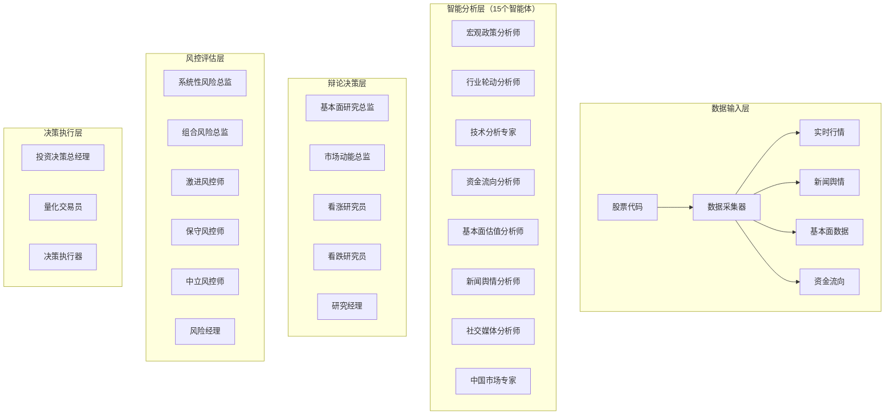

# 🏗️ InvestMind Pro - 融合架构设计方案
> 将现有10智能体系统与TradingAgents-CN深度融合的全栈架构设计

## 📊 一、现状对比分析

### 1.1 现有InvestMind Pro系统
```
当前架构（10个智能体）：
├── 第一阶段：专业分析师（5个）
│   ├── 宏观政策分析师 (macro)
│   ├── 行业轮动分析师 (industry)  
│   ├── 技术分析专家 (technical)
│   ├── 资金流向分析师 (funds)
│   └── 基本面估值分析师 (fundamental)
├── 第二阶段：经理团队（2个）
│   ├── 基本面研究总监 (manager_fundamental)
│   └── 市场动能总监 (manager_momentum)
├── 第三阶段：风控团队（2个）
│   ├── 系统性风险总监 (risk_system)
│   └── 组合风险总监 (risk_portfolio)
└── 第四阶段：总经理决策（1个）
    └── 投资决策总经理 (gm)

特点：
✅ 层级清晰，递进分析
✅ 已有完整前端展示
✅ 支持多模型切换
❌ 缺乏辩论机制
❌ 输出非结构化
❌ 无闭环验证
```

### 1.2 TradingAgents-CN系统
```
TradingAgents架构：
├── 分析师层（4个基础分析）
│   ├── 新闻分析师 (news_analyst)
│   ├── 基本面分析师 (fundamentals_analyst)
│   ├── 市场分析师 (market_analyst)
│   └── 社交媒体分析师 (social_media_analyst)
├── 研究辩论层（多空辩论）
│   ├── 看涨研究员 (bull_researcher)
│   ├── 看跌研究员 (bear_researcher)
│   └── 研究经理 (research_manager)
├── 风险辩论层（三方辩论）
│   ├── 激进派 (aggressive_debator)
│   ├── 保守派 (conservative_debator)
│   ├── 中立派 (neutral_debator)
│   └── 风险经理 (risk_manager)
└── 执行层
    └── 交易员 (trader)

特点：
✅ 辩论决策机制
✅ 结构化输出
✅ 新闻舆情分析
❌ 分析师较少
❌ 缺乏行业/宏观视角
❌ UI较简单
```

## 🎯 二、融合架构设计

### 2.1 核心理念：双轨并行，优势互补



### 2.2 融合后的智能体矩阵

| 层级 | 原InvestMind Pro | TradingAgents-CN | 融合方案 | 功能定位 |
|------|---------------|------------------|----------|----------|
| **数据分析层** | | | | |
| 宏观分析 | ✅ 宏观政策分析师 | ❌ | 保留+增强 | 政策解读、大势判断 |
| 行业分析 | ✅ 行业轮动分析师 | ❌ | 保留+增强 | 板块轮动、行业比较 |
| 技术分析 | ✅ 技术分析专家 | ✅ 市场分析师 | 融合 | 技术指标、趋势分析 |
| 资金分析 | ✅ 资金流向分析师 | ❌ | 保留+增强 | 资金动向、主力行为 |
| 基本面 | ✅ 基本面估值分析师 | ✅ 基本面分析师 | 融合 | 财务分析、估值模型 |
| 新闻舆情 | ❌ | ✅ 新闻分析师 | 新增 | 舆情监控、情绪分析 |
| 社交媒体 | ❌ | ✅ 社交媒体分析师 | 可选新增 | 市场情绪、热点追踪 |
| **研究层** | | | | |
| 基本面总监 | ✅ | ❌ | 保留 | 整合基本面观点 |
| 市场总监 | ✅ | ❌ | 保留 | 整合市场面观点 |
| 多空辩论 | ❌ | ✅ 看涨/看跌研究员 | 新增 | 观点碰撞、消除偏见 |
| 研究经理 | ❌ | ✅ | 新增 | 研究决策整合 |
| **风控层** | | | | |
| 系统风险 | ✅ | ❌ | 保留 | 系统性风险评估 |
| 组合风险 | ✅ | ❌ | 保留 | 组合风险管理 |
| 三方辩论 | ❌ | ✅ 激进/保守/中立 | 新增 | 风险偏好平衡 |
| 风险经理 | ❌ | ✅ | 新增 | 风控决策整合 |
| **决策层** | | | | |
| 总经理 | ✅ | ❌ | 增强 | 最终决策、报告生成 |
| 交易员 | ❌ | ✅ | 新增 | 结构化订单生成 |

## 🚀 三、技术栈规划（FastAPI + Vue3）

### 3.0 前端迁移策略（HTML → Vue3）

#### 一键启动架构
```python
# 开发阶段：自动启动前后端
if DEV_MODE:
    subprocess.Popen(["npm", "run", "serve"], cwd="./alpha-council-vue")
    uvicorn.run("main:app", port=8000, reload=True)

# 生产阶段：前端嵌入后端
else:
    app.mount("/", StaticFiles(directory="./dist", html=True))
```

#### 核心优势
- **开发体验**：`python main.py` 一键启动全栈
- **部署简化**：单服务托管，无需Nginx
- **功能增强**：组件化开发，Vue生态支持
- **平滑迁移**：现有功能100%保留

详见：[Vue迁移实施方案](./VUE迁移实施方案.md)

### 3.1 后端架构（FastAPI）
```python
project/
├── backend/
│   ├── api/                    # API路由层
│   │   ├── v1/
│   │   │   ├── analysis.py     # 分析接口
│   │   │   ├── debate.py       # 辩论接口
│   │   │   ├── decision.py     # 决策接口
│   │   │   ├── trading.py      # 交易接口
│   │   │   └── backtest.py     # 回测接口
│   │   └── v2/                 # 未来扩展
│   │
│   ├── agents/                 # 智能体核心
│   │   ├── base/              # 基类定义
│   │   │   ├── agent.py       # 智能体基类
│   │   │   ├── analyst.py     # 分析师基类
│   │   │   └── manager.py     # 管理者基类
│   │   ├── analysts/          # 分析师实现
│   │   ├── managers/          # 管理者实现
│   │   ├── debators/          # 辩论者实现
│   │   └── traders/           # 交易员实现
│   │
│   ├── core/                   # 核心功能
│   │   ├── llm/               # LLM管理
│   │   │   ├── provider.py    # 多模型支持
│   │   │   └── prompt.py      # Prompt模板
│   │   ├── workflow/          # 工作流引擎
│   │   │   ├── pipeline.py    # 流水线
│   │   │   └── orchestrator.py# 编排器
│   │   └── memory/            # 记忆系统
│   │       ├── short_term.py  # 短期记忆
│   │       └── long_term.py   # 长期记忆
│   │
│   ├── dataflows/             # 数据流
│   │   ├── sources/          # 数据源
│   │   ├── cache/            # 缓存层
│   │   └── stream/           # 实时流
│   │
│   ├── models/                # 数据模型
│   │   ├── domain/           # 领域模型
│   │   ├── dto/              # 数据传输对象
│   │   └── entity/           # 数据实体
│   │
│   └── services/              # 业务服务
│       ├── analysis/         # 分析服务
│       ├── trading/          # 交易服务
│       ├── backtest/         # 回测服务
│       └── portfolio/        # 组合管理
```

### 3.2 前端架构（Vue3）
```javascript
frontend/
├── src/
│   ├── views/                 # 页面视图
│   │   ├── Analysis/         # 分析中心
│   │   │   ├── SingleStock.vue      # 个股分析
│   │   │   ├── MarketOverview.vue   # 市场概览
│   │   │   └── SectorRotation.vue   # 板块轮动
│   │   ├── Decision/         # 决策中心
│   │   │   ├── DebateRoom.vue       # 辩论室
│   │   │   ├── DecisionBoard.vue    # 决策面板
│   │   │   └── RiskControl.vue      # 风控中心
│   │   ├── Trading/          # 交易中心
│   │   │   ├── OrderManagement.vue  # 订单管理
│   │   │   ├── Portfolio.vue        # 持仓管理
│   │   │   └── Performance.vue      # 绩效分析
│   │   └── Backtest/         # 回测中心
│   │
│   ├── components/           # 组件库
│   │   ├── agents/          # 智能体组件
│   │   │   ├── AgentCard.vue        # 智能体卡片
│   │   │   ├── AgentDialog.vue      # 智能体对话
│   │   │   └── AgentNetwork.vue     # 智能体网络图
│   │   ├── charts/          # 图表组件
│   │   │   ├── KLineChart.vue       # K线图
│   │   │   ├── RadarChart.vue       # 雷达图
│   │   │   └── HeatMap.vue          # 热力图
│   │   └── debate/          # 辩论组件
│   │       ├── DebateArena.vue      # 辩论场
│   │       └── VotingPanel.vue      # 投票面板
│   │
│   ├── composables/          # 组合式函数
│   │   ├── useAgent.js       # 智能体hooks
│   │   ├── useDebate.js      # 辩论hooks
│   │   └── useTrading.js     # 交易hooks
│   │
│   └── stores/               # Pinia状态管理
│       ├── agents.js         # 智能体状态
│       ├── analysis.js       # 分析状态
│       └── trading.js        # 交易状态
```

## 🎨 四、功能规划与扩展性

### 4.1 核心功能模块

#### 📊 智能分析模块
```yaml
基础分析:
  - 个股深度分析（15个智能体协同）
  - 板块轮动分析
  - 市场情绪监控
  - 主力资金追踪

高级分析:
  - 多股对比分析
  - 组合优化建议
  - 风险预警系统
  - 事件驱动分析
```

#### 🎭 辩论决策模块
```yaml
辩论机制:
  - 多空观点辩论
  - 风险偏好辩论
  - 实时辩论直播
  - 历史辩论回放

决策生成:
  - 结构化决策输出
  - 决策置信度评分
  - 决策依据追溯
  - 决策审计日志
```

#### 📈 交易执行模块
```yaml
模拟交易:
  - 虚拟资金管理
  - 自动下单执行
  - 持仓动态调整
  - 收益实时计算

实盘对接（未来）:
  - 券商API集成
  - 风控限制设置
  - 交易确认机制
  - 应急止损系统
```

#### 📉 回测验证模块
```yaml
策略回测:
  - 历史数据回测
  - 参数优化
  - 蒙特卡洛模拟
  - 压力测试

绩效分析:
  - 收益率曲线
  - 夏普比率
  - 最大回撤
  - 胜率统计
```

### 4.2 创新特色功能

#### 🧠 智能体进化系统
```python
class AgentEvolution:
    """智能体自主进化"""
    
    def performance_tracking(self):
        """跟踪每个智能体的预测准确率"""
        
    def weight_adjustment(self):
        """动态调整智能体权重"""
        
    def prompt_optimization(self):
        """基于反馈优化Prompt"""
        
    def model_selection(self):
        """自动选择最佳模型"""
```

#### 🎮 可视化交互系统
```javascript
// 智能体协作可视化
const AgentCollaboration = {
  // 3D网络图展示智能体交互
  networkVisualization: '力导向图',
  
  // 实时数据流展示
  dataFlowAnimation: '粒子效果',
  
  // 辩论过程可视化
  debateVisualization: '对战动画',
  
  // 决策路径追踪
  decisionPathTracing: '决策树展示'
}
```

#### 📱 多端同步系统
```yaml
Web端:
  - 完整功能体验
  - 大屏数据展示
  - 多窗口协同

移动端:
  - 核心功能精简
  - 推送通知
  - 语音交互

API开放:
  - RESTful API
  - WebSocket推送
  - GraphQL查询
```

## 🏆 五、与TradingAgents-CN对比

### 5.1 优势对比

| 维度 | InvestMind Pro（融合后） | TradingAgents-CN | 优势分析 |
|------|------------------------|------------------|----------|
| **智能体数量** | 15-20个 | 10-12个 | ✅ 更全面的分析覆盖 |
| **分析维度** | 宏观+行业+个股+舆情 | 主要个股+舆情 | ✅ 多层次分析体系 |
| **决策机制** | 层级递进+辩论融合 | 纯辩论机制 | ✅ 更平衡的决策 |
| **UI体验** | Vue3现代化界面 | 基础Web界面 | ✅ 更好的用户体验 |
| **可视化** | 3D网络+动态图表 | 静态图表 | ✅ 更直观的展示 |
| **本地化** | 深度A股优化 | 通用框架 | ✅ 更适合中国市场 |
| **扩展性** | 模块化插件架构 | 单体架构 | ✅ 更易扩展维护 |
| **性能** | 异步+缓存+流处理 | 同步处理 | ✅ 更高的并发性能 |

### 5.2 差异化定位

```
TradingAgents-CN：
定位：研究型框架，注重算法和模型
适合：量化研究者、算法开发者
特点：学术性强，理论完备

InvestMind Pro（融合版）：
定位：实战型平台，注重用户体验和实用性
适合：专业投资者、投研团队、高端散户
特点：产品化程度高，可直接落地使用
```

## 🗺️ 六、实施路线图

### Phase 1：基础融合（2周）
- [x] 导入路径修复
- [ ] 统一数据接口
- [ ] 整合新闻分析师
- [ ] 基础API搭建

### Phase 2：Vue3迁移（3周）
- [ ] Vue3项目搭建
- [ ] 组件库开发
- [ ] 路由和状态管理
- [ ] 基础页面实现

### Phase 3：辩论系统（2周）
- [ ] 多空辩论实现
- [ ] 风险辩论实现
- [ ] 辩论可视化
- [ ] 决策整合

### Phase 4：交易系统（2周）
- [ ] 订单生成器
- [ ] 模拟交易引擎
- [ ] 持仓管理
- [ ] 收益计算

### Phase 5：高级功能（3周）
- [ ] 智能体进化
- [ ] 3D可视化
- [ ] 回测系统
- [ ] 策略优化

### Phase 6：产品化（2周）
- [ ] 用户系统
- [ ] 权限管理
- [ ] 部署优化
- [ ] 文档完善

## 🎯 七、核心竞争力

### 7.1 技术护城河
1. **多智能体协同算法**：独特的层级递进+辩论融合机制
2. **本地化优势**：深度适配A股市场特性
3. **可解释AI**：完整的决策路径追溯
4. **自适应学习**：基于反馈的智能体进化

### 7.2 产品护城河
1. **极致用户体验**：专业yet友好的界面
2. **一站式解决方案**：从分析到交易的完整闭环
3. **社区生态**：开放API和插件市场
4. **持续迭代**：快速响应市场需求

## 💡 八、未来展望

### 8.1 短期目标（6个月）
- 完成Vue3全栈迁移
- 实现完整的辩论决策系统
- 对接主流券商API
- 构建用户社区

### 8.2 中期目标（1年）
- AI模型自主进化
- 多市场支持（港股、美股）
- 机构版本发布
- 策略市场建设

### 8.3 长期愿景（2-3年）
- 成为专业投资者的AI助手标准
- 构建投资决策AI生态
- 实现完全自主交易
- 金融AI开放平台

## 📝 总结

InvestMind Pro融合架构将实现：
1. **更智能**：15+智能体协同，多维度深度分析
2. **更可信**：辩论机制消除偏见，决策可追溯
3. **更实用**：结构化输出，可直接执行
4. **更友好**：现代化UI，极致用户体验
5. **更开放**：模块化架构，易扩展集成

**核心价值主张**：不仅仅是一个分析工具，而是一个完整的**AI投资决策操作系统**。

---

*"让每个投资者都拥有自己的AI投研团队"*
