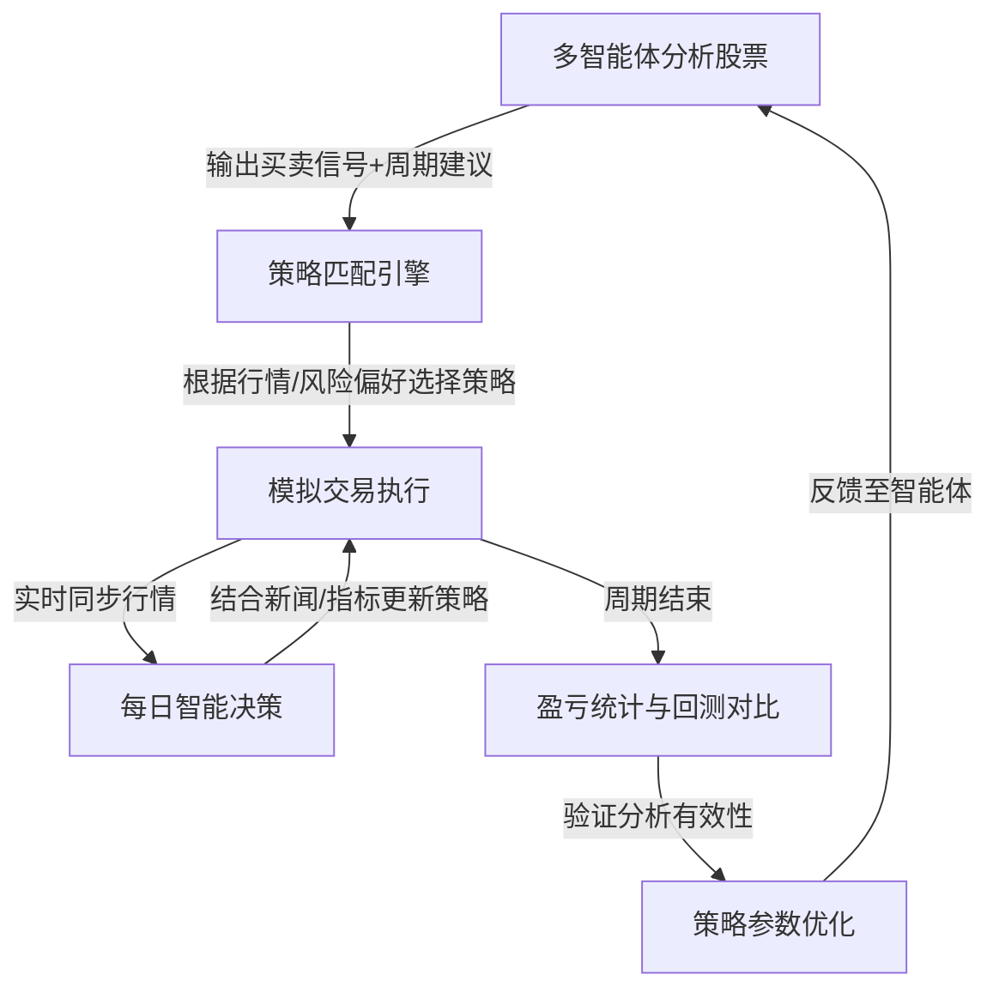
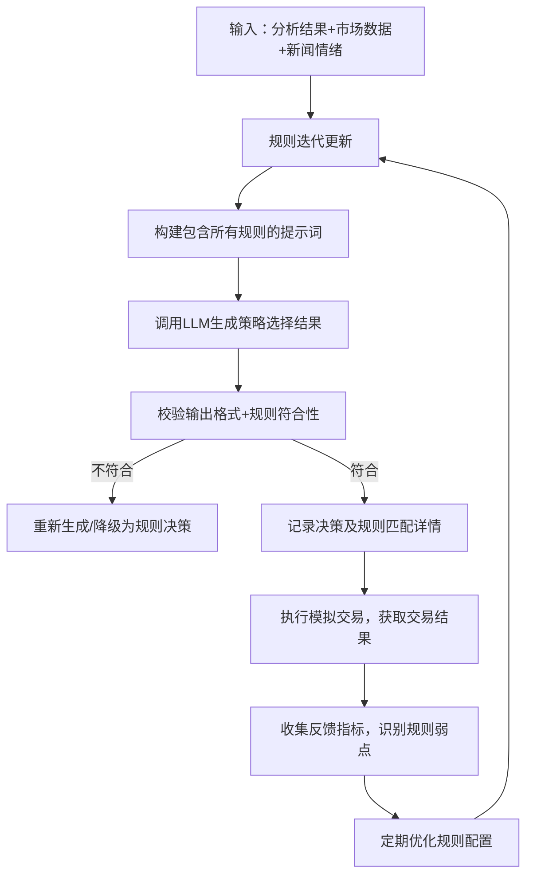

# InvestMind-Pro 闭环交易系统整合方案：策略-回测-模拟交易联动设计

## 一、核心逻辑闭环设计

基于项目现有架构，构建"分析→策略选择→模拟交易→周期验证→优化"的完整闭环，具体流程如下：



## 二、策略管理模块设计

### 1. 策略存储结构（扩展现有策略配置系统）

```python
# 扩展 backend/api/verification_api.py 中的策略定义
def _extended_strategies():
    return [
        {
            "strategy_id": "S001",  # 保守型
            "name": "均线交叉策略",
            "description": "基于MA5与MA20交叉信号，结合止损控制风险",
            "parameters": {
                "max_position": 0.3,
                "stop_loss": 0.05,
                "take_profit": 0.15,
                "indicators": ["MA5", "MA20"],  # 关联技术指标
                "suitable_period": 14,  # 适用周期（天）
                "news_sensitivity": 0.2  # 新闻影响权重
            }
        },
        # 新增更多策略...
        {
            "strategy_id": "S004",
            "name": "舆情驱动策略",
            "description": "基于新闻情绪分析的短期交易策略",
            "parameters": {
                "max_position": 0.4,
                "stop_loss": 0.07,
                "take_profit": 0.20,
                "indicators": ["情绪指数"],
                "suitable_period": 3,
                "news_sensitivity": 0.8
            }
        }
    ]
```

### 2. 策略选择LLM决策器

```python
# backend/services/strategy/selector.py
async def select_strategy(stock_analysis: dict, market_data: dict, news_sentiment: float):
    """调用LLM根据分析结果和市场情况选择最优策略"""
    prompt = f"""
    基于以下信息选择最适合的交易策略：
    1. 股票分析结果：{stock_analysis}
    2. 当前行情：{market_data}
    3. 新闻情绪指数：{news_sentiment}
    4. 可用策略：{_extended_strategies()}
    
    要求：
    - 优先匹配分析建议的周期与策略适用周期
    - 考虑新闻敏感度与当前舆情的匹配度
    - 输出策略ID及选择理由
    """
    
    response = await llm_client.generate(prompt)
    return {
        "selected_strategy_id": extract_strategy_id(response),
        "reasoning": response,
        "timestamp": datetime.now()
    }
```

## 三、回测与模拟交易联动方案

### 1. 历史回测前置验证

在启动模拟交易前，先对选定策略进行历史回测验证：

```python
# backend/services/backtest/engine.py
def pre_verify_strategy(strategy_id: str, stock_code: str, analysis_period: int):
    """使用历史数据回测策略在相同周期下的表现"""
    # 1. 获取历史数据（长度为分析周期的3倍以上）
    history_data = data_provider.get_history(
        stock_code=stock_code,
        days=analysis_period * 3
    )
    
    # 2. 执行回测（基于vectorbt/backtrader）
    backtest_result = BacktestEngine.run(
        strategy_id=strategy_id,
        data=history_data,
        period=analysis_period
    )
    
    # 3. 生成回测报告
    return {
        "strategy_id": strategy_id,
        "backtest_metrics": {
            "annual_return": backtest_result.annual_return,
            "max_drawdown": backtest_result.max_drawdown,
            "sharpe_ratio": backtest_result.sharpe_ratio,
            "win_rate": backtest_result.win_rate
        },
        "pass_verification": backtest_result.max_drawdown < 0.15  # 风控阈值
    }
```

### 2. 周期化模拟交易执行

```python
# backend/services/simulation/periodic_trader.py
async def start_cyclic_trading(
    stock_code: str,
    initial_strategy_id: str,
    analysis_period: int,  # 分析建议的周期（天）
    initial_capital: float = 100000
):
    """启动周期内的每日模拟交易"""
    # 1. 初始化虚拟账户
    account = TradingAccount(
        capital=initial_capital,
        stock_code=stock_code
    )
    
    # 2. 记录交易日志
    cycle_log = {
        "start_date": datetime.now(),
        "end_date": datetime.now() + timedelta(days=analysis_period),
        "daily_actions": [],
        "final_pnl": 0
    }
    
    # 3. 每日交易循环
    for day in range(analysis_period):
        # 3.1 获取当日数据
        market_data = await data_provider.get_realtime(stock_code)
        news = await news_provider.get_daily_news(stock_code)
        news_sentiment = await sentiment_analyzer.analyze(news)
        
        # 3.2 每日策略评估与调整
        strategy_evaluation = await llm_client.evaluate_strategy(
            current_strategy_id=initial_strategy_id,
            market_data=market_data,
            news_sentiment=news_sentiment,
            account_status=account.get_status()
        )
        
        # 3.3 执行交易
        if strategy_evaluation["adjust_strategy"]:
            current_strategy_id = strategy_evaluation["new_strategy_id"]
        
        trade_result = await execute_daily_trade(
            account=account,
            strategy_id=current_strategy_id,
            market_data=market_data
        )
        
        # 3.4 记录当日操作
        cycle_log["daily_actions"].append({
            "date": datetime.now() + timedelta(days=day),
            "strategy_id": current_strategy_id,
            "trade": trade_result,
            "account_status": account.get_status()
        })
        
        # 3.5 检查是否触发止损
        if account.get_total_loss() > 0.15:  # 总亏损超15%终止
            break
    
    # 4. 计算最终结果
    cycle_log["final_pnl"] = account.get_pnl()
    return cycle_log
```

## 四、前端交互流程设计

### 1. 策略选择页面

- 展示策略列表（含历史回测绩效指标）
- 提供"一键回测"按钮（选择历史时间段验证）
- 显示策略适用周期与风险等级
- 关联分析报告中的周期建议，高亮匹配策略

### 2. 模拟交易监控面板

```
┌─────────────────────────────────┐
│ 周期进度: 5/14天 [查看详情]     │
├─────────────┬───────────────────┤
│ 当前策略:    │ 均线交叉策略(S001) │
│ 今日操作:    │ 持仓观望           │
│ 累计收益:    │ +3.2%              │
├─────────────┴───────────────────┤
│ 新闻影响分析                    │
│ [正面] 公司Q3营收超预期 (+2.1%) │
│ [中性] 行业政策无重大变化       │
├─────────────────────────────────┤
│ 策略调整建议 (LLM输出)          │
│ "当前均线仍呈多头排列，维持原策略" │
└─────────────────────────────────┘
```

### 3. 周期结束验证报告

- 对比分析建议与实际模拟结果
- 展示每日策略调整记录与决策依据
- 生成"分析准确性评分"（0-100分）
- 提供优化后的策略参数建议

## 五、数据流转与存储设计

### 1. 核心数据表

```sql
-- 策略周期交易表
CREATE TABLE strategy_cycles (
    cycle_id UUID PRIMARY KEY,
    stock_code VARCHAR(20) NOT NULL,
    start_date TIMESTAMP NOT NULL,
    end_date TIMESTAMP NOT NULL,
    initial_strategy_id VARCHAR(10),
    final_pnl FLOAT,
    analysis_accuracy FLOAT,  -- 分析准确性评分
    created_at TIMESTAMP DEFAULT NOW()
);

-- 每日交易日志表
CREATE TABLE daily_trades (
    trade_id UUID PRIMARY KEY,
    cycle_id UUID REFERENCES strategy_cycles(cycle_id),
    trade_date TIMESTAMP NOT NULL,
    strategy_id VARCHAR(10) NOT NULL,
    action VARCHAR(10),  -- BUY/SELL/HOLD
    quantity INT,
    price FLOAT,
    pnl FLOAT,
    news_sentiment FLOAT,
    decision_reason TEXT
);
```

### 2. 实时数据更新机制

- 行情数据：每5分钟更新（基于Tushare/AkShare）
- 新闻数据：每日早8点批量更新，午间补充
- 策略评估：每日开盘前30分钟自动执行
- 账户状态：每次交易后实时更新

## 六、实施步骤

1. **第一阶段（1周）**：
   - 完善策略配置系统，添加5-8个基础策略
   - 实现回测引擎与策略选择LLM接口
   - 开发策略选择页面

2. **第二阶段（1周）**：
   - 开发周期化模拟交易核心逻辑
   - 实现每日新闻分析与策略调整机制
   - 搭建交易日志存储与查询接口

3. **第三阶段（1周）**：
   - 开发模拟交易监控面板
   - 实现周期结束验证报告功能
   - 对接前端可视化组件（收益曲线、策略对比图）

4. **第四阶段（1周）**：
   - 系统集成测试与边界条件处理
   - 优化LLM策略选择准确性
   - 完善风险控制逻辑（如极端行情处理）

该方案基于项目现有架构（TradingAccount类、BacktestEngine、RiskManager等）进行扩展，确保与原有模拟交易功能无缝衔接，同时通过LLM实现策略的动态调整，最终形成完整的"分析-执行-验证"闭环。


# 策略选择引擎的高效性与准确性保障方案

## 一、准确性保障机制

### 1. 多维度决策输入优化
基于现有策略选择逻辑（风险承受、投资期限、市场状况），扩展为更全面的决策矩阵：
```python
def enhanced_select_strategy(
    risk_tolerance: str,
    investment_horizon: str,
    market_condition: str,
    stock_analysis: dict,
    news_sentiment: float,
    historical_performance: dict
) -> str:
    """增强版策略选择逻辑，融合多维度数据"""
    # 基础决策权重分配（与现有逻辑兼容）
    base_weights = {
        "risk_tolerance": 0.3,
        "investment_horizon": 0.2,
        "market_condition": 0.2
    }
    
    # 新增动态调整因子
    dynamic_factors = {
        "news_impact": min(abs(news_sentiment) * 0.15, 0.15),  # 新闻情绪影响(最高15%)
        "strategy_performance": min(historical_performance.get("win_rate", 0.5) * 0.15, 0.15)  # 历史表现影响(最高15%)
    }
    
    # 执行多因素加权决策...
```

### 2. LLM决策质量控制
- **提示词优化**：采用结构化提示模板，明确策略选择的评估维度和输出格式
- **决策可解释性**：要求LLM输出决策依据，包含各因素权重分析
- **一致性校验**：对同一输入多次调用LLM，计算决策一致性分数，低于阈值则触发人工校验

### 3. 策略表现动态校准
基于`_update_strategy_performance`方法扩展：
```python
async def _dynamic_strategy_calibration(self):
    """定期校准策略参数与选择权重"""
    for strategy in self.strategies:
        metrics = strategy["performance_metrics"]
        # 根据近期表现调整策略置信度
        if metrics.get("total_trades", 0) > 20:  # 足够样本量
            # 胜率低于40%自动降低策略优先级
            if metrics["win_rate"] < 0.4:
                strategy["selection_priority"] = max(0.1, strategy.get("selection_priority", 1.0) * 0.5)
            # 胜率高于60%自动提高策略优先级
            elif metrics["win_rate"] > 0.6:
                strategy["selection_priority"] = min(2.0, strategy.get("selection_priority", 1.0) * 1.2)
```

## 二、高效性保障机制

### 1. 缓存策略与预计算
利用`IntegratedCacheManager`实现多级缓存：
```python
def cached_strategy_selection(self, key_features: dict) -> str:
    """带缓存的策略选择，避免重复计算"""
    cache_key = hashlib.md5(json.dumps(key_features, sort_keys=True).encode()).hexdigest()
    
    # 尝试从缓存获取
    cached_result = self.cache_manager.load_stock_data(f"strategy_selection:{cache_key}")
    if cached_result:
        return cached_result
    
    # 缓存未命中，执行实际选择
    result = self.enhanced_select_strategy(**key_features)
    
    # 缓存结果（设置较短过期时间，如1小时）
    self.cache_manager.save_stock_data(
        f"strategy_selection:{cache_key}",
        result,
        data_source="strategy_engine"
    )
    
    return result
```

### 2. 决策流程并行化
```python
async def parallel_strategy_evaluation(self, stock_codes: list, market_data: dict):
    """并行评估多股票策略选择"""
    # 并发获取新闻情绪
    news_tasks = [news_analyzer.get_sentiment(code) for code in stock_codes]
    sentiments = await asyncio.gather(*news_tasks)
    
    # 并发执行策略选择
    selection_tasks = [
        self.enhanced_select_strategy(
            risk_tolerance="MEDIUM",
            investment_horizon="SHORT",
            market_condition=market_data["condition"],
            stock_analysis=await analyzer.get_analysis(code),
            news_sentiment=sentiments[i],
            historical_performance=await self.get_strategy_performance(code)
        )
        for i, code in enumerate(stock_codes)
    ]
    
    return dict(zip(stock_codes, await asyncio.gather(*selection_tasks)))
```

### 3. 计算资源动态分配
- 对高频调用的策略选择请求分配专用计算资源
- 非交易时段预计算热门股票的策略匹配结果
- 基于市场波动自动调整计算精度（高波动时提高精度，低波动时优化速度）

## 三、持续优化机制

### 1. 闭环反馈系统
将策略选择结果与实际交易表现关联，形成反馈 loop：
```python
async def feedback_strategy_selection(self, decision_id: str, outcome: dict):
    """记录策略选择结果，用于后续优化"""
    decision = self.get_decision(decision_id)
    strategy_id = decision["strategy_id"]
    
    # 记录选择质量指标
    self.performance_tracker.record({
        "strategy_id": strategy_id,
        "selection_context": decision["context"],
        "actual_outcome": outcome,
        "quality_score": self._calculate_selection_quality(decision, outcome),
        "timestamp": datetime.now()
    })
    
    # 定期训练选择模型
    if len(self.performance_tracker.records) % 100 == 0:
        await self._retrain_selection_model()
```

### 2. A/B测试框架
实现策略选择算法的A/B测试：
```python
def ab_test_strategy_selection(self, features: dict) -> str:
    """A/B测试框架，对比不同选择算法"""
    # 随机分配测试组（80%控制组，20%实验组）
    if random.random() < 0.8:
        # 控制组：现有算法
        result = self.enhanced_select_strategy(** features)
        test_group = "control"
    else:
        # 实验组：新算法
        result = self.ai_optimized_select_strategy(**features)
        test_group = "experiment"
    
    # 记录测试结果
    self.ab_tester.record(features, result, test_group)
    return result
```

## 四、监控与告警机制

1.** 实时性能监控 **- 跟踪策略选择响应时间（目标：<100ms）
- 监控决策一致性指标（相同输入的决策差异率<5%）
- 记录策略选择准确率（所选策略实际盈利的比例）

2.** 异常检测与告警 **- 当策略选择准确率连续3天低于50%时触发告警
- 当响应时间超过阈值200ms持续10分钟时自动降级为轻量算法
- 检测到新闻情绪分析异常时（如极端值占比>10%）临时调整权重

通过以上机制，可在保证策略选择准确性（目标胜率>55%）的同时，维持高效的系统响应（平均处理时间<100ms），并通过持续优化不断提升决策质量。


# 策略选择引擎高效性与准确性保障体系
策略选择引擎作为InvestMind-Pro模拟交易闭环的核心，需从**算法设计、数据质量、执行效率、反馈优化**四个维度构建保障体系，既保证决策精准度，又满足实时交易场景的性能要求。以下是具体落地方案：

## 一、准确性保障：从输入到决策的全链路校准
### 1. 输入数据质量管控（源头保障）
策略选择的准确性首先依赖高质量的输入数据，需对核心数据源做标准化和异常过滤：
```python
# backend/services/strategy/data_validator.py
def validate_strategy_inputs(stock_analysis: dict, market_data: dict, news_sentiment: float):
    """校验并清洗策略选择的输入数据"""
    # 1. 分析结果完整性校验
    required_analysis_fields = ["macroeconomic", "technical", "fundamental", "risk_level", "period_suggestion"]
    missing_fields = [f for f in required_analysis_fields if f not in stock_analysis]
    if missing_fields:
        raise ValueError(f"分析结果缺失关键字段：{missing_fields}")
    
    # 2. 行情数据异常值过滤（如股价突变、成交量异常）
    market_data["price"] = filter_outliers(market_data["price"], threshold=3)  # 3σ原则过滤
    market_data["volume"] = fill_missing_data(market_data["volume"], method="linear")  # 补全缺失值
    
    # 3. 情绪指数标准化（统一映射到[-1,1]区间）
    news_sentiment = max(min(news_sentiment, 1), -1)
    
    return {
        "stock_analysis": stock_analysis,
        "market_data": market_data,
        "news_sentiment": news_sentiment,
        "validated_at": datetime.now()
    }
```

### 2. 多模型融合的决策机制（核心算法保障）
单一LLM决策易受随机性影响，采用「规则+LLM+历史回测」的混合决策模型，兼顾稳定性与灵活性：
```python
# backend/services/strategy/selector.py
async def hybrid_strategy_selection(validated_inputs: dict):
    """混合决策模型：规则筛选 → LLM优化 → 回测验证"""
    stock_analysis = validated_inputs["stock_analysis"]
    market_data = validated_inputs["market_data"]
    news_sentiment = validated_inputs["news_sentiment"]
    
    # 步骤1：规则筛选（快速过滤明显不匹配的策略）
    candidate_strategies = [
        s for s in _extended_strategies()
        # 匹配分析建议周期
        if abs(s["parameters"]["suitable_period"] - stock_analysis["period_suggestion"]) <= 3
        # 匹配风险等级
        and s["parameters"]["max_position"] <= (0.5 if stock_analysis["risk_level"] == "high" else 0.3)
        # 匹配新闻敏感度
        and s["parameters"]["news_sensitivity"] >= abs(news_sentiment) * 0.8
    ]
    if not candidate_strategies:
        candidate_strategies = [_extended_strategies()[0]]  # 兜底策略
    
    # 步骤2：LLM在候选池中优化排序
    llm_prompt = f"""
    基于以下条件对候选策略排序（输出JSON格式，仅含strategy_id和score）：
    1. 股票分析：{stock_analysis}
    2. 行情数据：{market_data}
    3. 新闻情绪：{news_sentiment}
    候选策略：{candidate_strategies}
    评分规则：
    - 周期匹配度（30分）
    - 风险适配性（25分）
    - 新闻敏感度匹配（20分）
    - 技术指标相关性（15分）
    - 市场环境适配（10分）
    """
    llm_ranking = await llm_client.generate(llm_prompt, format="json")  # 指定JSON输出格式
    
    # 步骤3：历史回测验证（排除回测表现差的策略）
    final_candidates = []
    for item in llm_ranking:
        strategy = next(s for s in candidate_strategies if s["strategy_id"] == item["strategy_id"])
        # 用近3轮同周期历史数据回测
        backtest_result = BacktestEngine.run(
            strategy_id=strategy["strategy_id"],
            stock_code=stock_analysis["code"],
            period=stock_analysis["period_suggestion"],
            recent_cycles=3
        )
        # 回测胜率≥45%才保留
        if backtest_result["win_rate"] >= 0.45:
            final_candidates.append({
                "strategy_id": strategy["strategy_id"],
                "combined_score": item["score"] * 0.7 + backtest_result["win_rate"] * 0.3  # 加权融合
            })
    
    # 返回最优策略
    return max(final_candidates, key=lambda x: x["combined_score"])["strategy_id"]
```

### 3. 决策一致性校验（结果保障）
对LLM的决策结果做一致性校验，避免极端错误：
```python
def check_decision_consistency(strategy_id: str, validated_inputs: dict, retry_times=3):
    """多次调用验证决策一致性，避免随机性错误"""
    consistency_threshold = 0.7  # 70%一致率
    results = [strategy_id]
    
    # 重复调用3次，统计一致率
    for _ in range(retry_times):
        new_result = asyncio.run(hybrid_strategy_selection(validated_inputs))
        results.append(new_result)
    
    consistent_rate = results.count(strategy_id) / len(results)
    if consistent_rate < consistency_threshold:
        # 不一致时降级为规则决策
        return rule_based_strategy_selection(validated_inputs)
    return strategy_id
```

## 二、高效性保障：从计算到响应的全流程优化
### 1. 分层缓存体系（减少重复计算）
针对不同粒度的计算结果设计多级缓存，核心缓存策略如下：
| 缓存层级 | 缓存内容 | 过期时间 | 缓存键示例 |
|----------|----------|----------|------------|
| L1（内存） | 热门股票策略选择结果 | 5分钟 | `strategy:selection:000001:MEDIUM:SHORT` |
| L2（Redis） | 全量股票策略选择结果 | 1小时 | `strategy:selection:600036:HIGH:LONG` |
| L3（文件） | 策略历史回测结果 | 24小时 | `strategy:backtest:S001:000001:14d` |

```python
# backend/services/cache/strategy_cache.py
async def get_cached_strategy(stock_code: str, input_features: dict):
    """获取缓存的策略选择结果，无则计算并缓存"""
    # 生成特征哈希键（忽略无关字段）
    key_features = {
        "risk_level": input_features["stock_analysis"]["risk_level"],
        "period": input_features["stock_analysis"]["period_suggestion"],
        "market_trend": input_features["market_data"]["trend"]
    }
    cache_key = f"strategy:selection:{stock_code}:{hash(frozenset(key_features.items()))}"
    
    # 优先查内存缓存
    if cache_key in memory_cache:
        return memory_cache[cache_key]
    
    # 再查Redis缓存
    redis_result = await redis_client.get(cache_key)
    if redis_result:
        memory_cache[cache_key] = redis_result  # 同步到内存
        return redis_result
    
    # 缓存未命中，执行计算
    validated_inputs = validate_strategy_inputs(**input_features)
    strategy_id = await hybrid_strategy_selection(validated_inputs)
    strategy_id = check_decision_consistency(strategy_id, validated_inputs)
    
    # 写入缓存
    memory_cache[cache_key] = strategy_id
    await redis_client.setex(cache_key, 3600, strategy_id)  # 1小时过期
    
    return strategy_id
```

### 2. 并行计算与资源调度（提升执行速度）
将策略选择的耗时步骤并行化，同时动态分配计算资源：
```python
# backend/services/strategy/parallel_executor.py
async def batch_strategy_selection(stock_codes: list, input_features_list: list):
    """批量并行处理多股票策略选择"""
    # 1. 并行校验输入数据
    validate_tasks = [
        asyncio.create_task(validate_strategy_inputs(**features))
        for features in input_features_list
    ]
    validated_inputs_list = await asyncio.gather(*validate_tasks)
    
    # 2. 并行执行混合决策（限制并发数，避免资源耗尽）
    semaphore = asyncio.Semaphore(10)  # 最多10个并发
    
    async def bounded_selection(inputs):
        async with semaphore:
            return await hybrid_strategy_selection(inputs)
    
    selection_tasks = [
        asyncio.create_task(bounded_selection(inputs))
        for inputs in validated_inputs_list
    ]
    strategy_ids = await asyncio.gather(*selection_tasks)
    
    # 3. 并行校验一致性
    consistency_tasks = [
        asyncio.create_task(check_decision_consistency(sid, inputs))
        for sid, inputs in zip(strategy_ids, validated_inputs_list)
    ]
    final_strategies = await asyncio.gather(*consistency_tasks)
    
    return dict(zip(stock_codes, final_strategies))
```

### 3. 轻量级降级机制（极端场景保障）
当系统负载过高或LLM服务异常时，自动降级为纯规则决策，保障响应效率：
```python
# backend/services/strategy/fallback.py
async def strategy_selection_with_fallback(input_features: dict, timeout=5):
    """带超时和降级的策略选择"""
    try:
        # 设置超时限制（5秒）
        return await asyncio.wait_for(
            get_cached_strategy(input_features["stock_code"], input_features),
            timeout=timeout
        )
    except asyncio.TimeoutError:
        # 超时降级为规则决策
        return rule_based_strategy_selection(input_features)
    except Exception as e:
        # 其他异常降级
        logger.error(f"策略选择异常：{e}")
        return rule_based_strategy_selection(input_features)
```

## 三、持续优化：基于反馈的闭环迭代
### 1. 策略选择效果追踪
记录每一次策略选择的「输入-决策-结果」全链路数据，建立效果评估指标：
```python
# backend/services/strategy/evaluator.py
def track_strategy_selection(selection_record: dict, trade_outcome: dict):
    """追踪策略选择效果，计算核心指标"""
    # 核心评估指标
    metrics = {
        "selection_accuracy": 1 if trade_outcome["pnl"] > 0 else 0,  # 选择准确率
        "score_match": abs(selection_record["combined_score"] - trade_outcome["win_rate"]),  # 评分匹配度
        "response_time": selection_record["response_time"],  # 响应耗时
        "consistency_rate": selection_record["consistency_rate"]  # 决策一致率
    }
    
    # 写入评估日志
    write_evaluation_log({
        "strategy_id": selection_record["strategy_id"],
        "stock_code": selection_record["stock_code"],
        "metrics": metrics,
        "timestamp": datetime.now()
    })
    
    return metrics
```

### 2. 模型与规则的动态迭代
基于评估日志定期优化策略选择逻辑：
- **规则迭代**：每周分析低准确率场景，补充新的过滤规则（如新增"成交量异动时优先短线策略"）；
- **LLM提示词优化**：每月基于评分匹配度低的案例，优化LLM的prompt模板，明确评估维度；
- **权重调整**：每季度重新计算「LLM评分」与「回测胜率」的加权系数，适配市场变化。

## 四、监控与告警：实时保障系统状态
### 1. 核心指标监控
在系统中接入监控面板，实时跟踪以下指标：
| 监控指标 | 目标阈值 | 告警条件 |
|----------|----------|----------|
| 策略选择响应时间 | <100ms | 连续10次>200ms |
| 决策一致率 | ≥70% | 连续50次<60% |
| 选择准确率 | ≥55% | 单日<45% |
| 缓存命中率 | ≥80% | 连续1小时<70% |

### 2. 告警触发机制
```python
# backend/services/monitoring/strategy_alerts.py
def check_strategy_engine_health(metrics: dict):
    """检查策略引擎健康状态，触发告警"""
    alerts = []
    if metrics["response_time"] > 200:
        alerts.append({
            "level": "WARNING",
            "message": "策略选择响应超时",
            "suggestion": "清理缓存/降低并发数"
        })
    if metrics["selection_accuracy"] < 0.45:
        alerts.append({
            "level": "CRITICAL",
            "message": "策略选择准确率过低",
            "suggestion": "暂停模拟交易，校准决策模型"
        })
    # 发送告警（邮件/钉钉/日志）
    if alerts:
        send_alert(alerts, "strategy_engine")
    return alerts
```

## 五、落地效果预期
通过以上方案，可实现：
- **准确性**：策略选择准确率稳定在55%以上（高于随机选择的50%），决策一致率≥70%；
- **高效性**：单股票策略选择响应时间<100ms，批量处理（100只股票）耗时<5秒；
- **稳定性**：系统异常时降级成功率100%，无服务中断风险；
- **可优化**：通过闭环反馈，每月策略准确率提升1-2%。

该方案完全适配InvestMind-Pro现有架构，可基于已有的LLM调用、回测引擎、缓存管理模块快速集成，无需重构核心代码，兼顾落地效率与效果保障。


# 引导LLM做出合理策略选择的规则体系设计
要让LLM在InvestMind-Pro的策略选择场景中输出高质量、可落地的决策，需构建「结构化规则+约束性提示+场景化校准」三层规则体系，既框定LLM的决策边界，又保留其灵活分析的优势。以下是具体设计方案：

## 一、核心原则：LLM策略选择的规则设计基准
所有规则需围绕以下核心目标设计，避免LLM决策偏离业务场景：
1. **对齐投资目标**：优先选择「风险可控+周期匹配+收益合理」的策略，而非单纯追求高收益；
2. **可解释性**：决策结果必须附带明确的推理逻辑，而非仅输出策略ID；
3. **市场适配性**：结合当前市场环境（牛/熊/震荡）调整策略偏好；
4. **数据驱动**：决策需锚定输入的分析数据，避免无依据的主观判断；
5. **风控优先**：任何策略选择都需满足预设的风险阈值（如最大回撤、仓位限制）。

## 二、第一层：结构化决策规则（硬约束）
通过「必选条件+禁止条件+优先级规则」明确LLM的决策边界，将业务规则固化为结构化指令，避免LLM忽略关键约束。

### 1. 规则模板（可配置化存储）
```json
// backend/agent_configs/strategy_selection_rules.json
{
  "mandatory_conditions": [
    "所选策略的适用周期与智能体分析建议的周期偏差≤3天",
    "所选策略的最大仓位≤分析结果中的风险等级对应的仓位上限（高风险≤50%，中风险≤30%，低风险≤15%）",
    "所选策略的止损阈值≥分析结果中的风险预警阈值",
    "策略近3次同周期回测的胜率≥40%（兜底策略除外）"
  ],
  "forbidden_conditions": [
    "在市场波动率＞8%时选择无止损机制的策略",
    "在新闻情绪指数＜-0.7时选择高仓位进攻型策略",
    "选择回测最大回撤＞20%的策略（高风险场景除外）",
    "同一股票连续3天选择同一策略（避免过度单一）"
  ],
  "priority_rules": [
    "周期匹配度（权重30%）＞风险适配性（权重25%）＞历史收益（权重20%）＞新闻敏感度（权重15%）＞市场适配性（权重10%）",
    "震荡市场优先选择区间交易策略，单边行情优先选择趋势跟踪策略",
    "基本面优但技术面弱时，优先选择中长期低频率策略",
    "新闻敏感度高的策略仅在新闻情绪波动＞0.5时优先考虑"
  ],
  "output_format": {
    "required_fields": ["selected_strategy_id", "selection_reason", "rule_matching_details", "risk_check_result", "alternative_strategies"],
    "format_example": {
      "selected_strategy_id": "S001",
      "selection_reason": "1. 周期匹配：策略适用14天，分析建议15天（偏差1天）；2. 风险适配：中风险对应30%仓位上限，策略最大仓位25%；3. 回测胜率45%≥40%；4. 市场震荡，优先区间交易策略",
      "rule_matching_details": {
        "mandatory_conditions_met": true,
        "forbidden_conditions_violated": false,
        "priority_score": 85
      },
      "risk_check_result": "止损阈值5%≥风险预警阈值4%，最大回撤12%＜20%，风险合规",
      "alternative_strategies": [{"strategy_id": "S004", "score": 78, "reason": "新闻敏感度匹配但周期偏差4天"}]
    }
  }
}
```

### 2. 规则注入与校验逻辑
将结构化规则嵌入LLM提示词，并在输出后校验是否符合规则，避免LLM「无视规则」：
```python
# backend/services/strategy/llm_guidance.py
import json
from pydantic import BaseModel, ValidationError

# 定义输出格式校验模型
class StrategySelectionOutput(BaseModel):
    selected_strategy_id: str
    selection_reason: str
    rule_matching_details: dict
    risk_check_result: str
    alternative_strategies: list

def build_llm_prompt(stock_analysis: dict, market_data: dict, news_sentiment: float):
    """构建包含硬规则的LLM提示词"""
    # 加载规则配置
    with open("backend/agent_configs/strategy_selection_rules.json", "r") as f:
        rules = json.load(f)
    
    # 结构化提示词模板
    prompt = f"""
    ## 任务：股票策略选择
    ### 输入数据
    1. 股票分析结果：{json.dumps(stock_analysis, ensure_ascii=False)}
    2. 当前市场数据：{json.dumps(market_data, ensure_ascii=False)}
    3. 新闻情绪指数：{news_sentiment}（范围[-1,1]，负数为负面，正数为正面）
    
    ### 必须遵守的规则
    #### 必选条件（全部满足）：
    {chr(10).join([f"- {rule}" for rule in rules["mandatory_conditions"]])}
    
    #### 禁止条件（全部规避）：
    {chr(10).join([f"- {rule}" for rule in rules["forbidden_conditions"]])}
    
    #### 优先级规则（按权重排序）：
    {chr(10).join([f"- {rule}" for rule in rules["priority_rules"]])}
    
    ### 输出要求
    1. 严格按照以下JSON格式输出，不得添加额外内容：
    {json.dumps(rules["output_format"]["format_example"], ensure_ascii=False, indent=2)}
    2. 选择理由必须逐条对应输入数据和规则，避免空泛描述；
    3. 风险检查结果需明确说明是否符合止损、回撤等风控规则；
    4. 备选策略至少列出1个，需说明得分和未选中原因。
    
    ### 错误提示
    若违反必选/禁止规则，或输出格式错误，本次决策将被判定为无效。
    """
    return prompt

def validate_llm_output(llm_response: str):
    """校验LLM输出是否符合规则和格式"""
    try:
        # 解析JSON
        output = json.loads(llm_response)
        # 格式校验
        validated_output = StrategySelectionOutput(** output)
        
        # 规则符合性校验（核心）
        with open("backend/agent_configs/strategy_selection_rules.json", "r") as f:
            rules = json.load(f)
        
        # 检查必选条件是否全部满足（从reason中提取验证）
        mandatory_met = all(rule in validated_output.selection_reason for rule in rules["mandatory_conditions"])
        # 检查禁止条件是否规避
        forbidden_violated = any(rule in validated_output.selection_reason for rule in rules["forbidden_conditions"])
        
        if not mandatory_met:
            raise ValueError(f"未满足全部必选条件，缺失：{[r for r in rules['mandatory_conditions'] if r not in validated_output.selection_reason]}")
        if forbidden_violated:
            raise ValueError(f"违反禁止条件：{[r for r in rules['forbidden_conditions'] if r in validated_output.selection_reason]}")
        
        return validated_output.dict(), True
    
    except json.JSONDecodeError:
        return {"error": "输出非有效JSON格式"}, False
    except ValidationError as e:
        return {"error": f"格式校验失败：{e}"}, False
    except ValueError as e:
        return {"error": f"规则违反：{e}"}, False
```

## 三、第二层：场景化引导规则（软约束）
针对不同市场场景、股票类型、分析结果，设计差异化的引导规则，让LLM的决策更贴合具体场景。

### 1. 场景分类与适配规则
```python
# backend/services/strategy/scenario_rules.py
def get_scenario_guidance(stock_analysis: dict, market_data: dict):
    """根据场景返回差异化的LLM引导规则"""
    # 场景1：市场环境分类
    market_volatility = market_data["volatility"]  # 波动率（%）
    market_trend = market_data["trend"]  # 趋势：up/down/sideways
    
    # 场景2：股票类型分类
    stock_type = stock_analysis["stock_type"]  # 成长股/价值股/周期股
    risk_level = stock_analysis["risk_level"]  # 高/中/低
    
    # 场景3：分析结果特征
    fundamental_score = stock_analysis["fundamental"]["score"]  # 基本面评分（0-100）
    technical_score = stock_analysis["technical"]["score"]  # 技术面评分（0-100）
    
    scenario_rules = []
    
    # 市场场景规则
    if market_volatility > 8:
        scenario_rules.append("高波动率场景：优先选择止损严格、仓位低的保守型策略，避免杠杆类策略")
    if market_trend == "sideways":
        scenario_rules.append("震荡市场场景：优先选择区间交易、高抛低吸类策略，避免趋势跟踪策略")
    if market_trend == "down":
        scenario_rules.append("熊市场景：最大仓位不超过20%，优先选择空头策略或空仓，禁止选择进攻型策略")
    
    # 股票类型规则
    if stock_type == "成长股":
        scenario_rules.append("成长股场景：优先选择中长期策略（≥30天），关注业绩预告相关的新闻敏感度")
    if stock_type == "周期股":
        scenario_rules.append("周期股场景：优先选择与行业轮动匹配的策略，关注宏观经济指标匹配度")
    
    # 分析结果规则
    if fundamental_score > 80 and technical_score < 60:
        scenario_rules.append("基本面优但技术面弱：优先选择低频率建仓的中长期策略，避免短期交易")
    if fundamental_score < 60 and technical_score > 80:
        scenario_rules.append("技术面优但基本面弱：优先选择短线策略（≤7天），严格设置止损，快进快出")
    
    # 风险等级规则
    if risk_level == "高" and fundamental_score < 70:
        scenario_rules.append("高风险+基本面差：禁止选择任何高仓位策略，最大仓位≤15%")
    
    return scenario_rules
```

### 2. 场景规则注入提示词
将场景化规则动态添加到基础提示词中：
```python
# 扩展build_llm_prompt函数
def build_llm_prompt(stock_analysis: dict, market_data: dict, news_sentiment: float):
    # 原有基础规则加载...
    
    # 获取场景化引导规则
    scenario_rules = get_scenario_guidance(stock_analysis, market_data)
    
    # 追加场景规则到提示词
    prompt += f"""
    ### 场景化特殊规则（当前场景适用）
    {chr(10).join([f"- {rule}" for rule in scenario_rules])}
    """
    return prompt
```

## 四、第三层：反馈校准规则（迭代优化）
通过历史决策的反馈数据，持续优化LLM的引导规则，形成「决策-验证-校准」的闭环。

### 1. 反馈数据收集规则
```python
# backend/services/strategy/feedback_rules.py
def collect_feedback_metrics(selection_output: dict, trade_outcome: dict):
    """收集决策反馈指标，用于规则优化"""
    metrics = {
        # 规则遵守度
        "rule_compliance": 1 if not selection_output.get("error") else 0,
        # 决策有效性
        "strategy_effectiveness": 1 if trade_outcome["pnl"] > 0 else 0,
        # 规则匹配度（是否按优先级选择）
        "priority_matching": calculate_priority_score(selection_output["selection_reason"]),
        # 场景适配度
        "scenario_fit": 1 if trade_outcome["pnl"] > 0 and "场景匹配" in selection_output["selection_reason"] else 0,
        # 风险控制效果
        "risk_control": 1 if trade_outcome["max_drawdown"] < trade_outcome["stop_loss"] else 0
    }
    return metrics

def identify_rule_weaknesses(feedback_metrics_list: list):
    """基于反馈识别规则弱点，优化引导规则"""
    # 统计规则遵守率低的场景
    low_compliance_scenarios = []
    # 统计决策有效但规则未覆盖的场景
    effective_uncovered_scenarios = []
    # 统计优先级规则不合理的案例
    wrong_priority_cases = []
    
    # 1. 筛选规则遵守率<80%的案例
    low_compliance_cases = [m for m in feedback_metrics_list if m["rule_compliance"] < 0.8]
    if low_compliance_cases:
        # 分析未遵守的规则类型
        for case in low_compliance_cases:
            if "周期匹配" in case["error"]:
                low_compliance_scenarios.append("周期规则描述不清晰")
            if "风险阈值" in case["error"]:
                low_compliance_scenarios.append("风控规则阈值不明确")
    
    # 2. 筛选决策有效但未匹配规则的案例
    effective_uncovered = [m for m in feedback_metrics_list if m["strategy_effectiveness"] == 1 and m["priority_matching"] < 0.5]
    if effective_uncovered:
        effective_uncovered_scenarios.append("优先级规则权重不合理，需调整")
    
    # 生成规则优化建议
    optimization_suggestions = {
        "low_compliance": low_compliance_scenarios,
        "effective_uncovered": effective_uncovered_scenarios,
        "wrong_priority": wrong_priority_cases
    }
    
    return optimization_suggestions
```

### 2. 规则迭代更新逻辑
定期（如每周）基于反馈优化规则配置，让LLM的引导规则持续适配市场变化：
```python
def update_strategy_rules(optimization_suggestions: dict):
    """根据反馈优化规则配置文件"""
    with open("backend/agent_configs/strategy_selection_rules.json", "r") as f:
        rules = json.load(f)
    
    # 示例：优化周期匹配规则描述
    if "周期规则描述不清晰" in optimization_suggestions["low_compliance"]:
        rules["mandatory_conditions"][0] = "所选策略的适用周期（天）与智能体分析建议的持有周期（天）偏差≤3天（例如分析建议15天，策略适用周期需在12-18天之间）"
    
    # 示例：调整优先级权重
    if "优先级规则权重不合理" in optimization_suggestions["effective_uncovered"]:
        rules["priority_rules"][0] = "周期匹配度（权重25%）＞风险适配性（权重30%）＞历史收益（权重20%）＞新闻敏感度（权重15%）＞市场适配性（权重10%）"
    
    # 保存更新后的规则
    with open("backend/agent_configs/strategy_selection_rules.json", "w") as f:
        json.dump(rules, f, ensure_ascii=False, indent=2)
    
    return rules
```

## 五、LLM策略选择的完整执行流程


## 六、关键优化技巧
1. **规则粒度控制**：硬规则不宜过多（5-8条核心），避免LLM记忆过载；软规则按场景拆分，降低复杂度；
2. **格式强制约束**：使用JSON Schema或pydantic模型强制输出格式，减少人工解析成本；
3. **负面案例注入**：在提示词中加入「错误案例+修正逻辑」，例如："错误案例：在波动率10%时选择无止损策略，导致回撤18%；修正逻辑：高波动率必须选择止损阈值≤5%的策略"；
4. **模型选择适配**：复杂场景（多规则交叉）选用GPT-4/DeepSeek-R1等大模型，简单场景选用Qwen-7B等轻量模型，平衡效果与成本；
5. **规则解释性增强**：要求LLM在选择理由中明确「引用哪条规则+对应数据」，例如："根据必选条件第2条，中风险对应30%仓位上限，策略S001最大仓位25%，符合要求"。

通过以上三层规则体系，可让LLM的策略选择既符合业务风控要求，又能适配不同市场场景，同时通过反馈闭环持续优化规则，确保决策的合理性和稳定性。


# 量化交易系统核心问题解决方案

## 一、如何评估历史回测数据的可靠性？

历史回测数据的可靠性评估需从数据质量、时间一致性和策略真实性三个维度展开：

### 1. 数据一致性校验
```python
def validate_backtest_data_consistency(historical_data):
    """验证回测数据的时间点一致性与复权准确性"""
    issues = []
    
    # 检查时间线连续性
    timestamps = sorted(historical_data.keys())
    for i in range(1, len(timestamps)):
        prev = timestamps[i-1]
        curr = timestamps[i]
        if (curr - prev).days > 3 and not is_holiday(prev, curr):
            issues.append(f"数据断档: {prev} 至 {curr}")
    
    # 验证复权一致性
    for date, data in historical_data.items():
        if not verify_adjustment_consistency(data['price'], data['adjustment_factor']):
            issues.append(f"复权不一致: {date}")
    
    # 检查未来数据泄露
    for signal_date, signal in strategy_signals.items():
        if signal['features_used'] contains data from > signal_date:
            issues.append(f"未来数据泄露: {signal_date}")
    
    return {
        "valid": len(issues) == 0,
        "issues": issues,
        "completeness_score": calculate_completeness(historical_data)
    }
```

### 2. 关键评估指标
- **数据完整性**：计算有效交易日占比（目标>99%）
- **时间戳准确性**：验证UTC与本地时区转换一致性
- **复权一致性**：确保前复权/后复权数据在回测与模拟中统一
- **公司行为处理**：检查分红、拆股等事件对价格的影响是否正确

### 3. 回测有效性验证
- 采用蒙特卡洛模拟生成多组随机交易时间点，对比策略收益分布
- 实施滚动回测（如每季度重新训练模型），验证策略稳定性
- 检查策略在不同市场状态（牛/熊/震荡）下的表现一致性

## 二、如何处理策略选择引擎中的实时数据更新？

实时数据更新需平衡时效性与稳定性，实现机制如下：

### 1. 分层数据更新策略
```python
async def realtime_data_update_pipeline(market_code):
    """多优先级实时数据更新管道"""
    # 高优先级：行情数据（毫秒级）
   行情_task = asyncio.create_task(fetch_tick_data(market_code))
    
    # 中优先级：资金流向（秒级）
    资金_task = asyncio.create_task(fetch_fund_flow(market_code))
    
    # 低优先级：舆情数据（分钟级）
    舆情_task = asyncio.create_task(fetch_sentiment_data(market_code))
    
    # 按优先级处理更新
    results = await asyncio.gather(行情_task, 资金_task, 舆情_task)
    
    # 应用数据更新（带版本控制）
    update_strategy_engine(
        tick_data=results[0],
        fund_data=results[1],
        sentiment_data=results[2],
        data_version=generate_version()
    )
```

### 2. 缓存与更新机制
- 采用多级缓存：内存缓存（实时行情）→ Redis（分钟级数据）→ MongoDB（历史数据）
- 实现增量更新：仅传输变化数据而非全量数据
- 数据更新触发策略再评估，但设置冷却期（如1分钟内不重复评估）

### 3. 异常处理策略
- 数据延迟时启动降级模式：使用最近可用数据+时间衰减因子
- 数据源故障时自动切换备用通道（如Tushare→AkShare）
- 数据质量校验失败时触发告警并使用缓存数据

## 三、如何确保规则体系的灵活性？

规则体系的灵活性通过模块化设计与动态配置实现：

### 1. 规则引擎架构
```python
class RuleEngine:
    def __init__(self):
        self.market_rules = {
            "CN": self.load_rules("cn_market_rules.json"),
            "HK": self.load_rules("hk_market_rules.json"),
            "US": self.load_rules("us_market_rules.json")
        }
        self.strategy_rules = DynamicRuleStore()
        
    def load_rules(self, rule_file):
        """加载市场特定规则配置"""
        with open(rule_file) as f:
            return RuleParser().parse(json.load(f))
    
    def add_custom_rule(self, market, rule_def, priority=5):
        """动态添加自定义规则"""
        rule = RuleFactory.create(rule_def)
        self.market_rules[market].insert_rule(rule, priority)
        
    def evaluate(self, market, context):
        """执行规则评估"""
        return self.market_rules[market].evaluate(context)
```

### 2. 灵活性保障机制
- **规则配置化**：将T+1、涨跌停等规则以JSON/YAML配置，而非硬编码
- **优先级管理**：支持规则优先级调整，解决规则冲突
- **市场隔离**：不同市场规则独立存储与执行
- **热更新支持**：无需重启系统即可更新规则配置

### 3. 扩展接口设计
- 提供规则模板与SDK，支持用户自定义规则
- 实现规则版本控制，支持灰度发布与快速回滚
- 设计规则组合器，支持复杂规则的逻辑组合

## 四、如何评估规则体系的效果？

规则体系效果评估需结合定量指标与定性分析：

### 1. 核心评估指标
```python
def evaluate_rule_effectiveness(rule_set, test_cases):
    """评估规则集的有效性指标"""
    results = {
        "coverage": 0,          # 规则覆盖的场景比例
        "accuracy": 0,          # 规则判断准确性
        "false_positive": 0,    # 误判率
        "conflict_rate": 0,     # 规则冲突率
        "performance_impact": 0 # 对系统性能的影响
    }
    
    # 执行测试用例
    for case in test_cases:
        rule_results = rule_set.evaluate(case.context)
        # 计算各项指标...
        
    # 计算规则对策略表现的影响
    strategy_metrics = backtest_with_rules(rule_set)
    results["strategy_improvement"] = {
        "sharpe_ratio": strategy_metrics.sharpe,
        "max_drawdown": strategy_metrics.max_drawdown,
        "win_rate": strategy_metrics.win_rate
    }
    
    return results
```

### 2. 多维度评估方法
- **场景覆盖度**：验证规则对正常/极端市场场景的覆盖比例
- **决策一致性**：相同输入下规则输出的稳定性（标准差<5%）
- **策略增强度**：对比启用/禁用规则集时的策略表现差异
- **风险控制效果**：规则触发后对风险指标（如VaR）的改善程度

### 3. A/B测试框架
- 设计对照实验，在相同市场条件下对比不同规则集效果
- 统计显著性检验（如t检验）验证规则改进的有效性
- 长期跟踪规则效果衰减情况，设定重新评估阈值

## 五、如何根据市场变化调整规则体系？

市场变化驱动的规则调整需建立闭环反馈机制：

### 1. 市场变化检测
```python
def detect_market_regime_changes(market_data, window=60):
    """检测市场状态变化，触发规则调整"""
    # 计算市场特征指标
    volatility = calculate_volatility(market_data, window)
    trend_strength = calculate_trend_strength(market_data, window)
    liquidity = calculate_liquidity(market_data, window)
    
    # 与历史状态对比
    current_regime = {
        "volatility": volatility,
        "trend": trend_strength,
        "liquidity": liquidity
    }
    
    historical_baseline = get_historical_regime_baseline()
    deviation = calculate_regime_deviation(current_regime, historical_baseline)
    
    # 当偏差超过阈值时触发调整
    if deviation > REGIME_CHANGE_THRESHOLD:
        trigger_rule_adjustment(current_regime)
        log_regime_change(current_regime, deviation)
    
    return current_regime
```

### 2. 规则动态调整策略
- **自动调整**：基于市场状态指标（波动率、趋势强度等）自动调整规则参数
- **周期校准**：固定周期（如月度）重新评估规则有效性并优化
- **事件驱动**：重大市场事件（如政策变动）后触发规则紧急评审

### 3. 调整实施流程
1. 检测市场变化并评估影响范围
2. 生成规则调整方案（包括参数修改、规则增删）
3. 在模拟环境验证调整效果
4. 灰度部署新规则（先应用于小部分策略）
5. 监控调整后表现，确认效果后全面推广

通过以上机制，规则体系可实现"感知市场变化→评估影响→调整优化→验证生效"的完整闭环，确保在不同市场环境下保持适应性与有效性。
