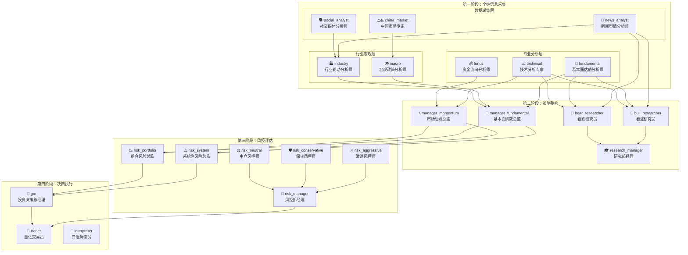

# 智能体依赖关系分析与优化方案

## 📊 一、智能体依赖关系完整分析

### 1.1 四阶段执行流程



### 1.2 依赖关系详细列表

| 智能体ID | 智能体名称 | 阶段 | 直接依赖 | 被依赖于 |
|---------|----------|------|---------|---------|
| **第一阶段 - 数据采集层** |
| news_analyst | 新闻舆情分析师 | 1 | 无 | industry, bull_researcher, bear_researcher |
| social_analyst | 社交媒体分析师 | 1 | 无 | industry |
| china_market | 中国市场专家 | 1 | 无 | macro |
| **第一阶段 - 行业宏观层** |
| industry | 行业轮动分析师 | 1 | news_analyst, social_analyst | manager_fundamental |
| macro | 宏观政策分析师 | 1 | china_market | manager_fundamental |
| **第一阶段 - 专业分析层** |
| technical | 技术分析专家 | 1 | 无 | bull_researcher, bear_researcher, manager_momentum |
| funds | 资金流向分析师 | 1 | 无 | manager_momentum |
| fundamental | 基本面估值分析师 | 1 | 无 | bull_researcher, bear_researcher, manager_fundamental |
| **第二阶段 - 策略整合** |
| bull_researcher | 看涨研究员 | 2 | news_analyst, fundamental, technical | research_manager |
| bear_researcher | 看跌研究员 | 2 | news_analyst, fundamental, technical | research_manager |
| manager_fundamental | 基本面研究总监 | 2 | fundamental, macro, industry | risk_system, risk_portfolio |
| manager_momentum | 市场动能总监 | 2 | technical, funds | risk_system, risk_portfolio |
| research_manager | 研究部经理 | 2 | bull_researcher, bear_researcher | 无 |
| **第三阶段 - 风控评估** |
| risk_aggressive | 激进风控师 | 3 | 无 | risk_manager |
| risk_conservative | 保守风控师 | 3 | 无 | risk_manager |
| risk_neutral | 中立风控师 | 3 | 无 | risk_manager |
| risk_system | 系统性风险总监 | 3 | manager_fundamental, manager_momentum | gm |
| risk_portfolio | 组合风险总监 | 3 | manager_fundamental, manager_momentum | gm |
| risk_manager | 风控部经理 | 3 | risk_aggressive, risk_conservative, risk_neutral | trader |
| **第四阶段 - 决策执行** |
| gm | 投资决策总经理 | 4 | risk_system, risk_portfolio | trader |
| trader | 量化交易员 | 4 | gm, risk_manager | 无 |
| interpreter | 白话解读员 | 4 | 无（但依赖所有结果） | 无 |

### 1.3 关键依赖链路

#### 3条核心依赖链：投资决策链、风控链、价值分析链
#### 4个冗余智能体：china_market、social_analyst、risk_system、manager_momentum
#### 9个核心必需智能体：不可禁用，是系统运行的基础

1. **核心价值链**：
   ```
   news_analyst → bull/bear_researcher → research_manager → 投资建议
   fundamental → manager_fundamental → risk_system → gm → trader → 交易执行
   ```

2. **风险控制链**：
   ```
   risk_aggressive/conservative/neutral → risk_manager → trader
   manager_fundamental/momentum → risk_system/portfolio → gm
   ```

3. **独立分析链**（可并行）：
   - china_market（仅影响macro）
   - social_analyst（仅影响industry）
   - funds（仅影响manager_momentum）

## 🎯 二、问题诊断

### 2.1 冗余智能体识别

基于依赖分析，以下智能体存在价值重叠或作用有限：

| 智能体 | 问题 | 影响范围 |
|-------|-----|---------|
| china_market | 功能与macro重叠，专注度过窄 | 仅影响macro |
| social_analyst | 与news_analyst功能重叠 | 仅影响industry |
| risk_system | 与risk_portfolio功能相似 | 都影响gm |
| manager_momentum | 功能较单一，仅整合2个源 | 影响风险评估 |

### 2.2 瓶颈智能体识别

| 智能体 | 瓶颈原因 | 被依赖次数 |
|-------|---------|----------|
| news_analyst | 被多个核心智能体依赖 | 3次 |
| fundamental | 影响投资决策核心 | 3次 |
| manager_fundamental | 风险评估入口 | 2次 |


### 选启用功能设计
提供了完整的实现方案：

1、智能依赖管理：
- 自动启用必需依赖
- 禁用检查与降级方案
- 影响预览与警告提示

2、三种默认配置：
- 最小化配置：9个智能体，45秒，适合快速决策
- 平衡配置：15个智能体，75秒，日常分析
- 完整配置：21个智能体，120秒，深度研究

3、前后端实现方案：
- 后端API：配置验证、依赖检查、影响计算
- 前端界面：分组展示、快速配置、影响预览

### 可以安全禁用的智能体（不影响核心功能）：

- china_market - 功能被macro覆盖
- social_analyst - 功能被news_analyst覆盖
- manager_momentum - 仅整合2个数据源，价值有限
- risk_system/portfolio - 功能重叠，保留其一即可
- interpreter - 白话解读，可按需启用

绝不能禁用的智能体（会破坏系统）：

- news_analyst - 基础信息源
- fundamental/technical - 核心分析
- bull/bear_researcher - 辩论必需
- research_manager - 投资建议生成
- gm/trader - 决策执行

## 💡 三、可选启用功能设计方案

### 3.1 智能体分级策略

将智能体分为三个级别：

```typescript
enum AgentPriority {
  CORE = "核心必需",      // 不可禁用
  IMPORTANT = "重要增强", // 可选但影响质量
  OPTIONAL = "可选补充"   // 可自由启用/禁用
}
```

### 3.2 智能体优先级配置

```javascript
const AGENT_PRIORITY_CONFIG = {
  // 核心必需（不可禁用）
  CORE: [
    'news_analyst',        // 基础信息源
    'fundamental',         // 基本面分析
    'technical',          // 技术面分析
    'bull_researcher',    // 多空辩论必需
    'bear_researcher',    // 多空辩论必需
    'research_manager',   // 投资建议生成
    'risk_manager',       // 风控决策
    'gm',                // 最终决策
    'trader'             // 交易执行
  ],
  
  // 重要增强（默认启用，可选禁用）
  IMPORTANT: [
    'macro',             // 宏观分析
    'industry',          // 行业分析
    'funds',             // 资金流向
    'manager_fundamental', // 基本面整合
    'risk_aggressive',   // 风控辩论
    'risk_conservative', // 风控辩论
    'risk_neutral'       // 风控辩论
  ],
  
  // 可选补充（默认禁用，可选启用）
  OPTIONAL: [
    'china_market',      // 中国市场专项
    'social_analyst',    // 社交媒体分析
    'manager_momentum',  // 动能分析
    'risk_system',       // 系统风险
    'risk_portfolio',    // 组合风险
    'interpreter'        // 白话解读
  ]
}
```

### 3.3 依赖自动处理机制

```javascript
class AgentDependencyManager {
  // 获取智能体的完整依赖链
  getFullDependencies(agentId) {
    const deps = new Set()
    const queue = [agentId]
    
    while (queue.length > 0) {
      const current = queue.shift()
      const agent = this.getAgent(current)
      
      if (agent.dependencies) {
        agent.dependencies.forEach(dep => {
          if (!deps.has(dep)) {
            deps.add(dep)
            queue.push(dep)
          }
        })
      }
    }
    
    return Array.from(deps)
  }
  
  // 智能启用策略
  smartEnableAgent(agentId) {
    const config = this.loadConfig()
    
    // 1. 启用目标智能体
    config.enabled[agentId] = true
    
    // 2. 自动启用必需依赖
    const deps = this.getFullDependencies(agentId)
    deps.forEach(dep => {
      if (AGENT_PRIORITY_CONFIG.CORE.includes(dep)) {
        config.enabled[dep] = true // 核心依赖必须启用
      }
    })
    
    // 3. 检查并警告可选依赖
    const optionalDeps = deps.filter(d => 
      AGENT_PRIORITY_CONFIG.OPTIONAL.includes(d) && 
      !config.enabled[d]
    )
    
    if (optionalDeps.length > 0) {
      this.showWarning(
        `智能体 ${agentId} 依赖以下可选智能体：${optionalDeps.join(', ')}。
        建议启用以获得最佳效果。`
      )
    }
    
    return config
  }
  
  // 智能禁用策略
  smartDisableAgent(agentId) {
    // 核心智能体不允许禁用
    if (AGENT_PRIORITY_CONFIG.CORE.includes(agentId)) {
      throw new Error(`核心智能体 ${agentId} 不允许禁用`)
    }
    
    const config = this.loadConfig()
    const dependents = this.findDependents(agentId)
    
    // 检查是否有启用的智能体依赖此智能体
    const activeDependents = dependents.filter(d => config.enabled[d])
    
    if (activeDependents.length > 0) {
      // 提供降级方案
      return this.proposeGracefulDegradation(agentId, activeDependents)
    }
    
    config.enabled[agentId] = false
    return config
  }
  
  // 降级方案
  proposeGracefulDegradation(agentId, dependents) {
    const degradations = {
      'china_market': {
        fallback: null,
        message: 'macro将使用通用市场分析代替中国市场专项分析'
      },
      'social_analyst': {
        fallback: 'news_analyst',
        message: 'industry将仅依赖新闻分析，不含社交媒体情绪'
      },
      'manager_momentum': {
        fallback: null,
        message: '风险评估将缺少动能分析维度'
      },
      'risk_system': {
        fallback: 'risk_portfolio',
        message: '系统性风险将由组合风险分析覆盖'
      }
    }
    
    return degradations[agentId] || {
      fallback: null,
      message: `禁用${agentId}可能影响${dependents.join(', ')}的分析质量`
    }
  }
}
```

### 3.4 前端配置界面设计

```vue
<template>
  <div class="agent-config-panel">
    <h3>智能体启用配置</h3>
    
    <!-- 快速配置 -->
    <div class="quick-config">
      <button @click="applyProfile('minimal')">最小化配置</button>
      <button @click="applyProfile('balanced')">平衡配置</button>
      <button @click="applyProfile('complete')">完整配置</button>
    </div>
    
    <!-- 分组配置 -->
    <div class="agent-groups">
      <!-- 核心智能体（不可修改） -->
      <div class="group core">
        <h4>🔴 核心智能体（必需）</h4>
        <div v-for="agent in coreAgents" :key="agent.id">
          <label>
            <input type="checkbox" :checked="true" disabled />
            <span>{{ agent.icon }} {{ agent.name }}</span>
            <span class="badge">必需</span>
          </label>
        </div>
      </div>
      
      <!-- 重要智能体 -->
      <div class="group important">
        <h4>🟡 重要智能体（推荐）</h4>
        <div v-for="agent in importantAgents" :key="agent.id">
          <label>
            <input 
              type="checkbox" 
              v-model="config.enabled[agent.id]"
              @change="handleToggle(agent.id)"
            />
            <span>{{ agent.icon }} {{ agent.name }}</span>
            <span class="impact" v-if="getImpact(agent.id)">
              影响：{{ getImpact(agent.id) }}
            </span>
          </label>
        </div>
      </div>
      
      <!-- 可选智能体 -->
      <div class="group optional">
        <h4>🟢 可选智能体</h4>
        <div v-for="agent in optionalAgents" :key="agent.id">
          <label>
            <input 
              type="checkbox" 
              v-model="config.enabled[agent.id]"
              @change="handleToggle(agent.id)"
            />
            <span>{{ agent.icon }} {{ agent.name }}</span>
            <span class="desc">{{ agent.description }}</span>
          </label>
        </div>
      </div>
    </div>
    
    <!-- 影响预览 -->
    <div class="impact-preview" v-if="pendingChanges.length > 0">
      <h4>配置影响预览</h4>
      <ul>
        <li v-for="change in pendingChanges" :key="change.agent">
          {{ change.message }}
        </li>
      </ul>
    </div>
    
    <!-- 统计信息 -->
    <div class="stats">
      <div>启用智能体：{{ enabledCount }}/{{ totalCount }}</div>
      <div>预计分析时间：{{ estimatedTime }}秒</div>
      <div>API调用成本：{{ estimatedCost }}次</div>
    </div>
  </div>
</template>
```

### 3.5 后端API实现

```python
# backend/api/agent_config_api.py
from typing import Dict, List, Optional
from pydantic import BaseModel

class AgentConfigRequest(BaseModel):
    """智能体配置请求"""
    enabled: Dict[str, bool]  # 智能体启用状态
    profile: Optional[str]     # 配置方案

class DependencyCheck(BaseModel):
    """依赖检查结果"""
    agent_id: str
    missing_deps: List[str]
    optional_deps: List[str]
    warnings: List[str]
    can_proceed: bool

@router.post("/api/agents/config/validate")
async def validate_agent_config(request: AgentConfigRequest):
    """验证智能体配置的合法性"""
    
    results = []
    for agent_id, enabled in request.enabled.items():
        if not enabled:
            continue
            
        agent = registry.get_agent(agent_id)
        if not agent:
            continue
            
        check = DependencyCheck(
            agent_id=agent_id,
            missing_deps=[],
            optional_deps=[],
            warnings=[],
            can_proceed=True
        )
        
        # 检查必需依赖
        if agent.dependencies:
            for dep_id in agent.dependencies:
                dep = registry.get_agent(dep_id)
                if not dep:
                    continue
                    
                if dep.id in CORE_AGENTS and not request.enabled.get(dep_id, False):
                    check.missing_deps.append(dep_id)
                    check.can_proceed = False
                elif dep.id in OPTIONAL_AGENTS and not request.enabled.get(dep_id, False):
                    check.optional_deps.append(dep_id)
                    check.warnings.append(
                        f"建议启用 {dep.name} 以增强 {agent.name} 的分析效果"
                    )
        
        results.append(check)
    
    return {
        "valid": all(r.can_proceed for r in results),
        "checks": results
    }

@router.post("/api/agents/config/apply")
async def apply_agent_config(request: AgentConfigRequest):
    """应用智能体配置"""
    
    # 保存配置到数据库或缓存
    config_manager.save_config(request.enabled)
    
    # 计算影响
    impact = calculate_config_impact(request.enabled)
    
    return {
        "success": True,
        "enabled_count": sum(1 for v in request.enabled.values() if v),
        "estimated_time": impact["time"],
        "estimated_cost": impact["cost"],
        "quality_score": impact["quality"]
    }

def calculate_config_impact(enabled: Dict[str, bool]) -> Dict:
    """计算配置的影响"""
    
    # 基础时间成本
    time_costs = {
        "CORE": 5,      # 核心智能体平均5秒
        "IMPORTANT": 3,  # 重要智能体平均3秒
        "OPTIONAL": 2    # 可选智能体平均2秒
    }
    
    total_time = 0
    total_cost = 0
    quality_score = 100
    
    for agent_id, is_enabled in enabled.items():
        if not is_enabled:
            # 禁用智能体的影响
            if agent_id in IMPORTANT_AGENTS:
                quality_score -= 5  # 重要智能体影响5分
            elif agent_id in OPTIONAL_AGENTS:
                quality_score -= 2  # 可选智能体影响2分
        else:
            # 计算时间和成本
            if agent_id in CORE_AGENTS:
                total_time += time_costs["CORE"]
            elif agent_id in IMPORTANT_AGENTS:
                total_time += time_costs["IMPORTANT"]
            else:
                total_time += time_costs["OPTIONAL"]
            total_cost += 1
    
    return {
        "time": total_time,
        "cost": total_cost,
        "quality": max(0, quality_score)
    }
```

## 📋 四、实施建议

### 4.1 分阶段实施计划

**第一阶段（1周）**：
1. 实现后端依赖管理系统
2. 添加配置验证API
3. 创建默认配置方案

**第二阶段（1周）**：
1. 开发前端配置界面
2. 实现依赖警告提示
3. 添加影响预览功能

**第三阶段（测试优化）**：
1. 测试不同配置组合
2. 收集性能数据
3. 优化默认方案

### 4.2 默认配置方案

```javascript
const DEFAULT_PROFILES = {
  // 最小化配置（9个智能体，约45秒）
  minimal: {
    enabled: {
      news_analyst: true,
      fundamental: true,
      technical: true,
      bull_researcher: true,
      bear_researcher: true,
      research_manager: true,
      risk_manager: true,
      gm: true,
      trader: true
    }
  },
  
  // 平衡配置（15个智能体，约75秒）
  balanced: {
    enabled: {
      // 包含所有核心智能体
      ...minimal.enabled,
      // 添加重要增强智能体
      macro: true,
      industry: true,
      funds: true,
      manager_fundamental: true,
      risk_aggressive: true,
      risk_conservative: true
    }
  },
  
  // 完整配置（21个智能体，约120秒）
  complete: {
    enabled: Object.fromEntries(
      AGENTS.map(a => [a.id, true])
    )
  }
}
```

### 4.3 注意事项

1. **核心智能体保护**：绝不允许禁用核心智能体
2. **依赖自动处理**：禁用智能体时自动检查影响
3. **降级方案提示**：提供清晰的功能降级说明
4. **性能监控**：记录不同配置的实际表现
5. **用户教育**：通过UI提示解释各智能体作用

## 📊 五、预期效果

🔴 核心必需（9个）：必须启用，构成最小可用系统
🟡 重要增强（6个）：默认启用，提升分析质量
🟢 可选补充（6个）：按需启用，特定场景增强

| 配置方案 | 智能体数量 | 分析时间 | 分析质量 | 适用场景 |
|---------|----------|---------|---------|---------|
| 最小化 | 9个 | ~45秒 | 80% | 快速决策 |
| 平衡 | 15个 | ~75秒 | 93% | 日常分析 |
| 完整 | 21个 | ~120秒 | 100% | 深度研究 |
| 自定义 | 可变 | 可变 | 可变 | 特定需求 |

通过智能体可选启用功能，用户可以：
- 🚀 减少30-60%的分析时间
- 💰 降低API调用成本
- 🎯 聚焦关键分析维度
- 🔧 根据需求灵活配置
