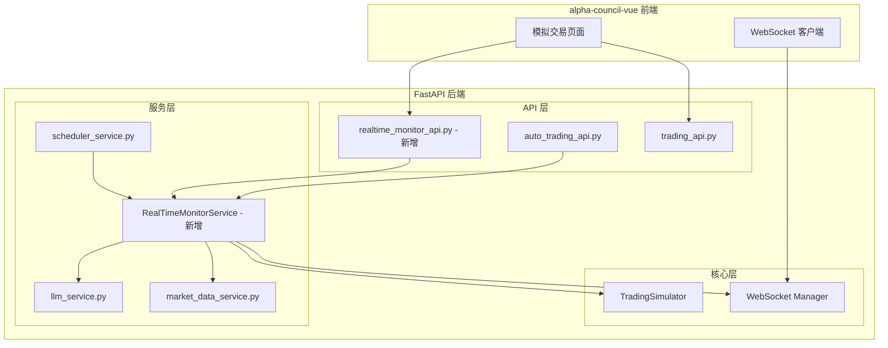
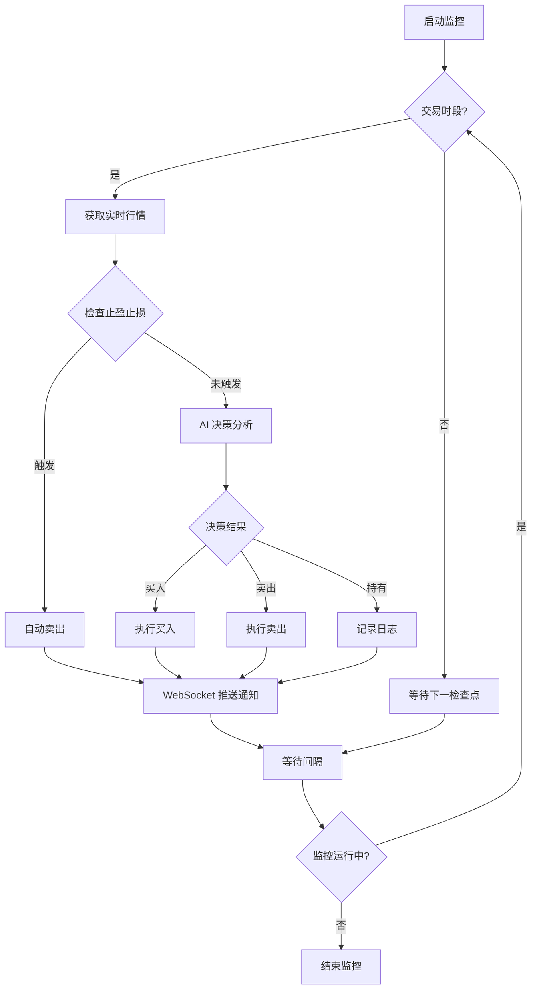

# 实时盯盘功能集成方案

## 1. 背景分析

### 1.1 当前主项目模拟交易架构

```
主项目 (alpha-council-vue + backend)
├── trading_api.py          # 模拟交易引擎 TradingSimulator
├── auto_trading_api.py     # 自动交易任务管理
├── scheduler_service.py    # 定时任务调度 (APScheduler + Cron)
└── trading_llm_config_api.py # LLM配置
```

**当前模式**：固定时间点触发（09:35, 10:30, 13:30, 14:30）

### 1.2 aiagents-stock 智能盯盘系统

```
aiagents-stock
└── smart_monitor_engine.py  # SmartMonitorEngine
    ├── 实时监控循环（独立线程）
    ├── 可配置监控间隔（默认5分钟）
    ├── 交易时段检查
    ├── DeepSeek AI 决策
    └── 止盈止损管理
```

**目标模式**：实时循环监控（可配置间隔）

## 2. 集成架构设计

### 2.1 系统架构图



### 2.2 实时监控服务流程



### 2.3 监控模式对比

| 特性 | 固定时间点模式 | 实时循环模式 |
|------|---------------|-------------|
| 触发方式 | Cron 表达式 | 循环 + sleep |
| 监控频率 | 每天4次 | 每5分钟（可配置） |
| 适用场景 | 低频策略 | 高频盯盘 |
| 资源消耗 | 低 | 中等 |
| 响应速度 | 慢 | 快 |

## 3. 核心组件设计

### 3.1 RealTimeMonitorService 类设计

```python
# backend/services/realtime_monitor_service.py

class RealTimeMonitorService:
    """实时盯盘服务 - 参考 aiagents-stock SmartMonitorEngine"""
    
    def __init__(self):
        self.is_running: bool = False
        self.monitor_interval: int = 300  # 默认5分钟
        self.monitored_stocks: List[str] = []
        self.stop_loss_config: Dict[str, float] = {}  # 止损配置
        self.take_profit_config: Dict[str, float] = {}  # 止盈配置
        self._monitor_task: Optional[asyncio.Task] = None
        
    async def start_monitor(self) -> bool:
        """启动实时监控"""
        
    async def stop_monitor(self) -> bool:
        """停止实时监控"""
        
    def is_trading_time(self) -> bool:
        """检查是否在交易时段"""
        
    async def _monitor_loop(self):
        """监控主循环"""
        
    async def _check_stop_loss_take_profit(self, stock_code: str, current_price: float) -> Optional[str]:
        """检查止盈止损条件"""
        
    async def _make_ai_decision(self, stock_code: str, market_data: Dict) -> Dict:
        """调用 AI 进行决策"""
        
    async def _execute_decision(self, stock_code: str, decision: Dict) -> Dict:
        """执行交易决策"""
        
    async def _notify_clients(self, event_type: str, data: Dict):
        """通过 WebSocket 推送通知"""
```

### 3.2 API 端点设计

```python
# backend/api/realtime_monitor_api.py

router = APIRouter(prefix="/api/realtime-monitor", tags=["Realtime Monitor"])

@router.post("/start")
async def start_realtime_monitor(config: MonitorConfig):
    """启动实时监控"""

@router.post("/stop")
async def stop_realtime_monitor():
    """停止实时监控"""

@router.get("/status")
async def get_monitor_status():
    """获取监控状态"""

@router.put("/config")
async def update_monitor_config(config: MonitorConfig):
    """更新监控配置"""

@router.post("/stocks/{stock_code}")
async def add_monitored_stock(stock_code: str, sl_config: StopLossConfig):
    """添加监控股票"""

@router.delete("/stocks/{stock_code}")
async def remove_monitored_stock(stock_code: str):
    """移除监控股票"""
```

### 3.3 配置模型

```python
class MonitorConfig(BaseModel):
    """监控配置"""
    interval_seconds: int = Field(300, ge=60, le=3600, description="监控间隔秒数")
    enable_ai_decision: bool = Field(True, description="是否启用AI决策")
    enable_auto_trade: bool = Field(False, description="是否自动执行交易")
    trading_hours_only: bool = Field(True, description="仅在交易时段运行")

class StopLossConfig(BaseModel):
    """止盈止损配置"""
    stop_loss_rate: Optional[float] = Field(None, ge=0, le=1, description="止损比例")
    take_profit_rate: Optional[float] = Field(None, ge=0, le=1, description="止盈比例")
    trailing_stop: bool = Field(False, description="是否启用移动止损")
```

## 4. 实施步骤

### 阶段一：核心服务实现
1. 创建 `RealTimeMonitorService` 类
2. 实现交易时段检查功能
3. 集成现有 LLM 决策服务
4. 实现监控任务的启动/停止控制

### 阶段二：API 和集成
5. 添加止盈止损自动触发机制
6. 创建实时监控 API 端点
7. 扩展 scheduler_service 支持实时监控模式
8. 实现 WebSocket 事件推送

### 阶段三：前端和测试
9. 添加监控配置持久化
10. 前端添加实时监控控制面板
11. 编写集成测试

## 5. 与现有系统的兼容性

### 5.1 复用现有组件
- **TradingSimulator**: 直接复用，通过 `execute_trade()` 执行交易
- **LLM 决策服务**: 复用 `call_trading_decision_llm()`
- **市场数据服务**: 复用 `get_realtime_quote()`
- **WebSocket**: 复用现有的 `websocket_api.py`

### 5.2 新增组件
- `backend/services/realtime_monitor_service.py` - 实时监控服务
- `backend/api/realtime_monitor_api.py` - API 端点

### 5.3 修改组件
- `backend/services/scheduler_service.py` - 添加实时监控模式选项
- `backend/server.py` - 注册新路由

## 6. 风险和注意事项

1. **资源消耗**: 实时监控会增加 API 调用频率，需要注意限流
2. **AI 成本**: 频繁调用 LLM 会增加成本，建议添加决策缓存
3. **并发安全**: 监控循环和手动交易可能产生竞争，需要加锁
4. **错误处理**: 网络异常、API 超时需要优雅处理，避免监控中断