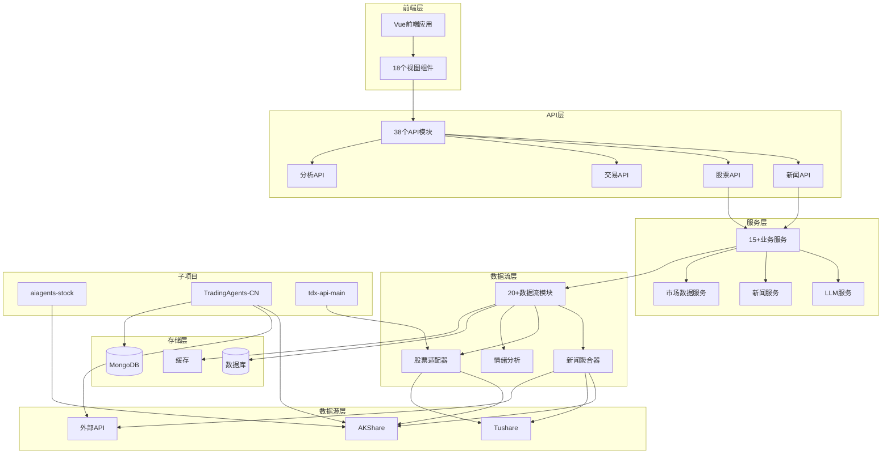

# 

### 1.3 新闻与情绪API
| 模块 | 功能 | 主要接口 |
|------|------|----------|
| `news_api.py` | 新闻数据 | 新闻获取、情绪分析 |
| `unified_news_api_endpoint.py` | 统一新闻 | 多源聚合 |
| `sentiment_api.py` | 情绪分析 | 市场情绪 |


| 目录 | 功能 | 主要文件 |
|------|------|----------|
| `news/` | 新闻数据 | 多源新闻聚合、实时新闻 |
| `sentiment/` | 情绪分析 | 市场情绪、舆情分析 |
| `longhubang/` | 龙虎榜 | 龙虎榜数据获取 |
| `sector_rotation/` | 板块轮动 | 板块分析 |
| `technical/` | 技术分析 | 技术指标计算 |
| `stock/` | 股票数据 | 股票基础数据 |
| `announcement/` | 公告 | 公司公告 |
| `legal/` | 法律信息 | 诉讼、处罚 |
| `risk/` | 风险分析 | 风险评估 |
| `providers/` | 数据提供者 | 多源数据接口 |
| `cache/` | 缓存 | 数据缓存 |
| `persistence/` | 持久化 | 数据存储 |
| `scheduler/` | 调度 | 定时任务 |
| `akshare/` | AKShare | AKShare接口封装 |


| 服务 | 功能 |
|------|------|
| `llm_service.py` | LLM服务 |
| `market_data_service.py` | 市场数据服务 |
| `news_data_service.py` | 新闻数据服务 |
| `news_sync_service.py` | 新闻同步服务 |
| `background_news_service.py` | 后台新闻服务 |
| `social_media_service.py` | 社交媒体服务 |
| `wencai_selector.py` | 问财选股服务 |


### 5.1 aiagents-stock
AI智能体股票分析子项目，提供：
- 问财数据获取 (`pywencai`)
- AKShare数据获取
- 股票新闻和公告

### 5.2 TradingAgents-CN
交易智能体子项目，提供：
- 多市场新闻聚合 (A股/港股/美股)
- 实时新闻获取
- 统一新闻工具
- 多智能体协作框架

### 5.3 tdx-api-main
通达信API集成，提供：
- 通达信数据接口
- 实时行情数据
- 历史数据查询

---

## 六、新闻数据获取接口对比分析

### 6.1 主项目 (backend/)

#### news_api.py - 新闻分析API
| 接口路径 | 功能 | 数据源 |
|---------|------|--------|
| `/api/news/analyze` | 新闻情绪分析 | 多源聚合 |
| `/api/news/list` | 获取新闻列表 | 多源聚合 |
| `/api/news/sources` | 获取可用新闻源 | 配置信息 |
| `/api/news/sentiment/history` | 历史情绪趋势 | 数据库 |
| `/api/news/data/latest` | 最新新闻 | 数据库 |
| `/api/news/data/search` | 全文搜索 | 数据库 |
| `/api/news/data/statistics` | 新闻统计 | 数据库 |
| `/api/news/realtime` | 实时新闻 | AKShare东方财富 |

**支持的新闻源**：
- 东方财富 (eastmoney)
- 新浪财经 (sina)
- 雪球 (xueqiu)
- 财联社 (cls)
- Tushare (tushare)
- 聚合数据 (juhe)

#### dataflow_api.py - 数据流监控API
| 接口路径 | 功能 | 数据源 |
|---------|------|--------|
| `/api/dataflow/news` | 获取新闻列表 | 后台缓存 |
| `/api/dataflow/stock/news/{ts_code}` | 股票新闻 | AKShare多源 |
| `/api/dataflow/stock/sentiment/{ts_code}` | 股票情绪分析 | AI分析 |

#### multi_source_news_aggregator.py - 多源新闻聚合器
**数据源优先级**：
1. **Tushare新闻** (需5000积分)
   - 接口: `tushare_api.news(src='sina')`
   - 特点: 新浪财经新闻，需要高积分
   
2. **AKShare个股新闻** (多接口降级)
   - 优先级1: `ak.stock_news_em()` - 东方财富个股新闻
   - 优先级2: `ak.stock_info_global_em()` - 东方财富全球资讯
   - 优先级3: `ak.stock_info_global_cls()` - 财联社全球资讯
   - 优先级4: `ak.news_economic_baidu()` - 百度财经新闻
   - 备选: `realtime_news` - 东方财富实时新闻

3. **市场要闻**
   - 优先级1: `ak.stock_info_global_em()` - 东方财富全球资讯
   - 优先级2: `ak.stock_info_global_cls()` - 财联社全球资讯
   - 优先级3: `ak.news_cctv()` - 央视新闻
   - 优先级4: `ak.news_economic_baidu()` - 百度财经新闻

---

### 6.2 aiagents-stock 子项目

#### news_announcement_data.py - 问财新闻
| 函数 | 功能 | 数据源 |
|------|------|--------|
| `get_stock_news()` | 获取股票新闻 | pywencai |
| `get_stock_announcements()` | 获取股票公告 | pywencai |

**实现方式**：
```python
# 使用问财查询
pywencai.get(query=f"{symbol}新闻")
pywencai.get(query=f"{symbol}公告")
```

**特点**：
- 仅支持中国A股
- 依赖问财API
- 查询方式简单直接

#### qstock_news_data.py - AKShare新闻
| 函数 | 功能 | 数据源 |
|------|------|--------|
| `get_stock_news()` | 获取股票新闻 | AKShare |

**数据源优先级**：
1. `ak.stock_news_em()` - 东方财富个股新闻
2. `ak.stock_news_sina()` - 新浪财经新闻 (已废弃)
3. `ak.stock_news_cls()` - 财联社电报 (已废弃)

---

### 6.3 TradingAgents-CN 子项目

#### realtime_news.py - 实时新闻聚合器
| 类/函数 | 功能 | 数据源 |
|---------|------|--------|
| `RealtimeNewsAggregator` | 实时新闻聚合 | 多源 |
| `get_realtime_news()` | 获取实时新闻 | 多源 |

**数据源优先级**：
1. **FinnHub实时新闻** (需API密钥)
   - 支持美股、港股
   - 实时性最好
   
2. **Alpha Vantage新闻** (需API密钥)
   - 支持美股
   - 包含情绪分析
   
3. **NewsAPI** (需API密钥)
   - 全球新闻
   - 支持关键词搜索
   
4. **中文财经新闻** (免费)
   - AKShare东方财富: `ak.stock_news_em()`
   - 财联社RSS
   
5. **Google新闻** (备用)
   - 使用googlenews库
   - 作为最后备选

**特点**：
- 支持A股、港股、美股
- 包含新闻紧急度评估
- 包含相关性计算
- 多市场覆盖

#### unified_news_tool.py - 统一新闻工具
| 类/函数 | 功能 | 数据源 |
|---------|------|--------|
| `UnifiedNewsAnalyzer` | 统一新闻分析 | 多源 |
| `get_stock_news_unified()` | 统一新闻获取 | 自动识别 |

**股票类型识别**：
- A股: `00/30/60/68`开头的6位数字
- 港股: `.HK`后缀或4-5位数字
- 美股: 1-5位字母

**A股新闻获取优先级**：
1. 数据库缓存 (MongoDB)
2. AKShare同步 (如缓存为空)
3. 东方财富实时新闻: `get_realtime_stock_news()`
4. Google新闻中文搜索
5. OpenAI全球新闻

**港股新闻获取优先级**：
1. Google新闻港股搜索
2. OpenAI全球新闻
3. 实时新闻

**美股新闻获取优先级**：
1. OpenAI全球新闻
2. Google新闻英文搜索
3. FinnHub新闻

---

## 七、新闻数据源汇总对比

| 数据源         | 主项目 | aiagents-stock | TradingAgents-CN | 特点 |
|--------       |--------|----------------|------------------|------|
| **东方财富**  | ✅ 主要 | ✅ 主要 | ✅ 主要 | 免费、稳定、A股专用 |
| **财联社**    | ✅ 备选 | ✅ 备选 | ✅ RSS | 实时性好、财经专业 |
| **新浪财经**  | ✅ Tushare | ❌ 已废弃 | ❌ | 需Tushare积分 |
| **百度财经**  | ✅ 备选 | ❌ | ❌ | 覆盖面广 |
| **央视新闻**  | ✅ 备选 | ❌ | ❌ | 权威性高 |
| **问财**      | ❌ | ✅ 主要 | ❌ | 智能查询 |
| **FinnHub**   | ❌ | ❌ | ✅ 美股 | 需API密钥 |
| **Alpha Vantage** | ❌ | ❌ | ✅ 美股 | 需API密钥 |
| **NewsAPI**   | ❌ | ❌ | ✅ 全球 | 需API密钥 |
| **Google新闻** | ❌ | ❌ | ✅ 备选 | 免费、全球 |
| **Tushare**   | ✅ 可选 | ❌ | ❌ | 需5000积分 |
| **聚合数据**  | ✅ 可选 | ❌ | ❌ | 需API密钥 |
| **雪球**      | ✅ 可选 | ❌ | ❌ | 社区讨论 |

---

## 八、系统架构图



---

## 九、数据流架构图

```mermaid
graph TB
    subgraph 数据源层
        EM[东方财富]
        CLS[财联社]
        SINA[新浪财经]
        BAIDU[百度财经]
        CCTV[央视新闻]
        WENCAI[问财]
        FINNHUB[FinnHub]
        ALPHAV[Alpha Vantage]
        NEWSAPI[NewsAPI]
        GOOGLE[Google新闻]
        TUSHARE[Tushare]
    end
    
    subgraph 数据获取层
        AK[AKShare库]
        PW[pywencai库]
        API[外部API]
    end
    
    subgraph 聚合层
        MAIN[主项目聚合器]
        AI[aiagents-stock]
        TA[TradingAgents-CN]
    end
    
    subgraph 存储层
        DB[(数据库)]
        CACHE[缓存]
    end
    
    subgraph API层
        NEWS_API[/api/news/*]
        DATAFLOW_API[/api/dataflow/*]
    end
    
    EM --> AK
    CLS --> AK
    SINA --> TUSHARE
    BAIDU --> AK
    CCTV --> AK
    WENCAI --> PW
    FINNHUB --> API
    ALPHAV --> API
    NEWSAPI --> API
    GOOGLE --> API
    
    AK --> MAIN
    AK --> AI
    AK --> TA
    PW --> AI
    API --> TA
    TUSHARE --> MAIN
    
    MAIN --> DB
    MAIN --> CACHE
    AI --> DB
    TA --> DB
    
    DB --> NEWS_API
    CACHE --> DATAFLOW_API
```

---

## 十、推荐使用策略

### A股新闻获取
1. **首选**: 东方财富 (`ak.stock_news_em()`) - 免费、稳定
2. **备选**: 财联社 (`ak.stock_info_global_cls()`) - 实时性好
3. **补充**: 问财 (`pywencai`) - 智能查询

### 港股新闻获取
1. **首选**: Google新闻港股搜索
2. **备选**: FinnHub (需API密钥)

### 美股新闻获取
1. **首选**: FinnHub (需API密钥)
2. **备选**: Alpha Vantage (需API密钥)
3. **补充**: Google新闻英文搜索

---


### 可选配置
| 配置项 | 用途 | 获取方式 |
|--------|------|----------|
| `TUSHARE_TOKEN` | Tushare数据 | tushare.pro注册 |
| `FINNHUB_API_KEY` | FinnHub新闻 | finnhub.io注册 |
| `ALPHA_VANTAGE_KEY` | Alpha Vantage | alphavantage.co注册 |
| `NEWS_API_KEY` | NewsAPI | newsapi.org注册 |
| `OPENAI_API_KEY` | OpenAI服务 | openai.com注册 |
| `MONGODB_URI` | MongoDB连接 | 本地或云服务 |
